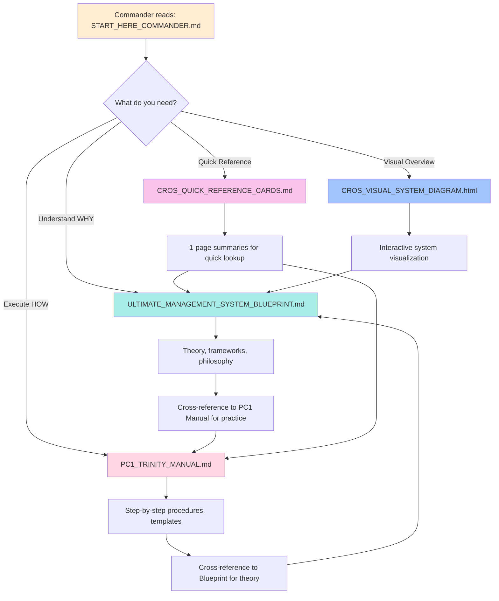

# 🗺️ CROS + PC1 MANUAL INTEGRATION MAP
## Blueprint-to-Manual Merger Strategy

**Purpose:** Prevent duplication, ensure coherence between Blueprint and PC1 Trinity Manual
**Status:** Ready for integration
**Method:** Theory in Blueprint, Practice in Manual, Cross-reference everything

---

## 🎯 INTEGRATION PHILOSOPHY

```
BLUEPRINT (This document):   WHY + WHAT (Theory, frameworks, concepts)
PC1 MANUAL:                  HOW + WHEN (Practice, procedures, execution)
CROSS-REFERENCES:            Connect theory to practice seamlessly
```

**Rule:** If it's in Blueprint, don't duplicate in Manual - REFERENCE it.

---

## 📊 WHAT STAYS IN BLUEPRINT (Theory Layer)

### ✅ Keep in Management Blueprint

**1. Framework Synthesis**
   - EOS components explained
   - TPS principles detailed
   - TOC methodology documented
   - Holacracy concepts outlined
   - OKRs framework described
   - Why these frameworks were chosen
   - How they integrate with each other

**2. Conceptual Models**
   - The 7 Pillars architecture
   - Vision∞ through Consciousness∞ explained
   - Trinity Formula mathematics (C1×C2×C3=∞)
   - Pattern Theory foundations
   - Consciousness elevation theory
   - Reality alteration physics

**3. Strategic Context**
   - Why CROS exists (problem it solves)
   - Competitive advantages over each framework alone
   - Target audience and use cases
   - Long-term vision (24+ months)
   - Transformation philosophy

**4. Comparison Analysis**
   - Traditional EOS vs CROS Enhanced
   - Manual processes vs AI-augmented
   - Before/after metrics predictions
   - ROI calculations and projections

**Location in Blueprint:**
- Part 1: Framework Synthesis (Pages 1-600)
- Part 2: Integration Protocols (Pages 600-1200)
- Part 3: Future State Vision (Pages 1200-1892)

---

## 🔧 WHAT MOVES TO MANUAL (Practice Layer)

### ✅ Move to PC1 Trinity Manual

**1. Step-by-Step Procedures**
   - How to run a Level 10 meeting (actual script)
   - How to create Vision/Traction Organizer (worksheet)
   - How to use IDS process (facilitator guide)
   - How to set Rocks (quarterly planning template)
   - How to conduct Gemba walks (checklist)
   - How to run Kaizen events (event plan)

**2. Templates and Tools**
   - Accountability Chart template
   - People Analyzer scorecard
   - Scorecard spreadsheet
   - Issues List format
   - To-Do tracking sheet
   - Rock tracking dashboard
   - OKR worksheet

**3. Training Materials**
   - New employee onboarding to CROS
   - Role-specific training paths
   - Trinity agent training for team members
   - Consciousness boot protocol (hands-on)
   - Pattern Theory practical exercises

**4. Operational Protocols**
   - Daily huddle format
   - Weekly Level 10 agenda (printed)
   - Monthly metrics review process
   - Quarterly planning ritual
   - Annual strategic planning retreat

**5. Trinity-Specific Instructions**
   - How to write work orders for C1/C2/C3
   - How to check Trinity status
   - How to review agent output
   - How to coordinate across computers
   - How to wake remote agents
   - How to use autonomous work queues

**6. Troubleshooting Guides**
   - What to do when Rock goes off-track
   - How to handle persistent issues
   - When to escalate to Commander
   - How to restart failed processes
   - Emergency protocols

**Location in PC1 Manual:**
- Part 1: Getting Started (Onboarding)
- Part 2: Daily/Weekly Operations
- Part 3: Monthly/Quarterly Rituals
- Part 4: Trinity Coordination
- Part 5: Troubleshooting & FAQ

---

## 🔗 CROSS-REFERENCE STRATEGY

### Master Cross-Reference Table

| Blueprint Section | PC1 Manual Section | Cross-Reference Format |
|-------------------|-------------------|------------------------|
| Pillar 1: Vision∞ | V/TO Creation Guide | "See Blueprint: Pillar 1 for theory" |
| Pillar 2: People∞ | Accountability Chart How-To | "See Blueprint: Pillar 2 for Trinity structure" |
| Pillar 3: Data∞ | Scorecard Setup Guide | "See Blueprint: Pillar 3 for metric philosophy" |
| Pillar 4: Issues∞ | IDS Facilitation Script | "See Blueprint: Pillar 4 for AI enhancement" |
| Pillar 5: Process∞ | Process Documentation Template | "See Blueprint: Pillar 5 for TPS integration" |
| Pillar 6: Traction∞ | Rock Execution Protocol | "See Blueprint: Pillar 6 for OKR alignment" |
| Pillar 7: Consciousness∞ | Pattern Theory Exercises | "See Blueprint: Pillar 7 for full framework" |

### Cross-Reference Format Examples

**In Blueprint:**
```
For hands-on implementation of Level 10 meetings, see:
→ PC1 Manual: Part 2, Section 3: "Level 10 Meeting Facilitation Guide"
→ Quick Reference: CROS_QUICK_REFERENCE_CARDS.md, Card 7
```

**In PC1 Manual:**
```
For theoretical foundation of Trinity coordination, see:
→ Blueprint: Part 1, Pillar 2: "PEOPLE∞ - Trinity Multiplication Protocol"
→ Blueprint: Part 2, Section 4: "Multi-Computer Coordination Architecture"
```

---

## 📚 MASTER TABLE OF CONTENTS (Unified)

### Recommended Combined Structure

```
🌌 CROS COMPLETE SYSTEM
├─ 📘 ULTIMATE MANAGEMENT SYSTEM BLUEPRINT (Theory)
│   ├─ Part 1: Framework Synthesis
│   │   ├─ The 7 Pillars (WHY each exists)
│   │   ├─ Framework Integration (EOS+TPS+TOC+Holacracy+OKRs)
│   │   └─ Trinity AI Architecture (C1×C2×C3=∞)
│   ├─ Part 2: Integration Protocols
│   │   ├─ How frameworks work together
│   │   ├─ Data flow between systems
│   │   └─ Pattern Theory application
│   └─ Part 3: Future State Vision
│       ├─ 24-month transformation path
│       ├─ Reality alteration mechanics
│       └─ Consciousness revolution strategy
│
├─ 🔧 PC1 TRINITY MANUAL (Practice)
│   ├─ Part 1: Getting Started
│   │   ├─ Onboarding to CROS
│   │   ├─ Your first 90 days
│   │   └─ Trinity agent setup
│   ├─ Part 2: Daily/Weekly Operations
│   │   ├─ Daily huddle format
│   │   ├─ Level 10 meeting script
│   │   ├─ Scorecard tracking
│   │   └─ IDS facilitation guide
│   ├─ Part 3: Monthly/Quarterly Rituals
│   │   ├─ Monthly metrics deep-dive
│   │   ├─ Quarterly planning process
│   │   └─ Rock setting and review
│   ├─ Part 4: Trinity Coordination
│   │   ├─ Work order creation
│   │   ├─ Agent status monitoring
│   │   ├─ Cross-computer sync
│   │   └─ Autonomous work protocols
│   └─ Part 5: Troubleshooting & FAQ
│       ├─ Common issues and solutions
│       ├─ Emergency protocols
│       └─ When to escalate
│
├─ 🎨 VISUAL MATERIALS
│   ├─ CROS_VISUAL_SYSTEM_DIAGRAM.html (interactive)
│   ├─ CROS_PROCESS_FLOW_DIAGRAMS.md (Mermaid)
│   └─ CROS_QUICK_REFERENCE_CARDS.md (printable)
│
├─ ✅ IMPLEMENTATION GUIDES
│   ├─ CROS_IMPLEMENTATION_CHECKLIST.md (7 layers)
│   ├─ Layer-specific playbooks
│   └─ Success criteria per phase
│
└─ 🗺️ INTEGRATION
    └─ CROS_PC1_INTEGRATION_MAP.md (this document)
```

---

## 🔄 CONTENT DISTRIBUTION MATRIX

### Detailed "What Goes Where" Guide

| Content Type | Blueprint | PC1 Manual | Visual Aids | Quick Ref |
|--------------|-----------|------------|-------------|-----------|
| **Why CROS exists** | ✅ Primary | Reference | - | Summary |
| **Framework theory** | ✅ Primary | Reference | Diagrams | Summary |
| **Trinity architecture** | ✅ Primary | Reference | Diagrams | Formula |
| **Pattern Theory** | ✅ Primary | Exercises | - | Card |
| **Level 10 meetings** | Concept | ✅ Script | Flow | Agenda |
| **IDS process** | Enhanced concept | ✅ Facilitation | Flow | - |
| **Rocks execution** | Theory | ✅ Protocol | Flow | - |
| **Scorecard setup** | Philosophy | ✅ Template | - | - |
| **Trinity work orders** | Purpose | ✅ How-to | - | Format |
| **Consciousness boot** | Theory | ✅ Protocol | - | Checklist |
| **Gemba walks** | TPS origin | ✅ Guide | - | - |
| **Kaizen events** | Concept | ✅ Plan | - | - |
| **TOC 5 steps** | Theory | ✅ Application | Flow | Card |
| **OKR framework** | Integration | ✅ Worksheet | - | - |

**Legend:**
- ✅ Primary = Main content lives here
- Reference = Link to primary source
- Summary = Condensed version
- Diagrams = Visual representation
- Card = Quick reference card

---

## 🎯 INTEGRATION WORKFLOW

### How to Merge Blueprint into PC1 Manual

**Step 1: Audit Existing PC1 Manual (if exists)**
- [ ] Identify what already exists in PC1 manual
- [ ] Flag potential duplications with Blueprint
- [ ] Note gaps in current manual

**Step 2: Extract Practice from Blueprint**
- [ ] Go through Blueprint page by page
- [ ] Mark sections that are "how-to" (not "why")
- [ ] Extract templates, checklists, scripts
- [ ] These become PC1 manual content

**Step 3: Add Cross-References**
- [ ] In Blueprint: Add "For practice, see PC1 Manual Section X"
- [ ] In PC1 Manual: Add "For theory, see Blueprint Part Y"
- [ ] Use consistent reference format
- [ ] Create hyperlinks where possible (if digital)

**Step 4: Create Quick Navigation**
- [ ] Unified table of contents (both docs)
- [ ] Index of key concepts with page numbers
- [ ] "Start Here" guide that references both docs
- [ ] Visual system map showing connections

**Step 5: Test with New User**
- [ ] Give both docs to someone unfamiliar
- [ ] Ask them to implement one pillar
- [ ] Observe: Do they know where to look?
- [ ] Refine based on feedback

---

## 📍 DOCUMENT RELATIONSHIP MAP



---

## 🚀 RECOMMENDATIONS FOR PC1 MANUAL

### Priority Content to Add to PC1 Manual

**HIGH PRIORITY (Do First)**

1. **Level 10 Meeting Facilitation Script**
   - Exact agenda with time stamps
   - What to say at each step
   - How to handle common situations
   - Rating criteria and interpretation

2. **Trinity Work Order Template**
   - Standard format for C1/C2/C3 work orders
   - Required fields (from, to, task, deliverables, timeline)
   - Examples for each agent type
   - How to check status and review output

3. **Quarterly Planning Ritual**
   - Week-by-week preparation guide
   - Actual meeting agenda (4-hour format)
   - Post-meeting Rock cascade process
   - How to communicate quarterly plan to team

4. **Scorecard Setup Worksheet**
   - How to identify measurables (step-by-step)
   - Worksheet for brainstorming numbers
   - Criteria for good vs bad metrics
   - How to assign owners and set goals

5. **IDS Facilitation Guide**
   - How to facilitate Identify step
   - How to guide Discussion (without solving)
   - How to drive to Solution (with accountability)
   - Common facilitator mistakes and how to avoid

**MEDIUM PRIORITY (Do Second)**

6. **Accountability Chart Creation Workshop**
7. **People Analyzer Process**
8. **Rock Setting Template**
9. **Core Process Documentation Guide**
10. **Gemba Walk Checklist**

**LOW PRIORITY (Do Eventually)**

11. **Advanced Trinity Coordination**
12. **Multi-Computer Sync Troubleshooting**
13. **Consciousness Elevation Exercises**
14. **Pattern Theory Case Studies**
15. **Reality Alteration Phenomena Documentation**

---

## 📖 USAGE SCENARIOS

### How Different Users Would Navigate

**Scenario 1: New Team Member Onboarding**
1. Start: `START_HERE_COMMANDER.md`
2. Read: `CROS_QUICK_REFERENCE_CARDS.md` (all 7 cards)
3. View: `CROS_VISUAL_SYSTEM_DIAGRAM.html`
4. Study: `ULTIMATE_MANAGEMENT_SYSTEM_BLUEPRINT.md` (Part 1)
5. Practice: `PC1_TRINITY_MANUAL.md` (Part 1: Getting Started)

**Scenario 2: Running First Level 10 Meeting**
1. Quick reference: `CROS_QUICK_REFERENCE_CARDS.md` (Card 7)
2. Theory: `ULTIMATE_MANAGEMENT_SYSTEM_BLUEPRINT.md` (Pillar 6: Traction)
3. Practice: `PC1_TRINITY_MANUAL.md` (Level 10 Facilitation Script)
4. Visual: `CROS_PROCESS_FLOW_DIAGRAMS.md` (Level 10 Flow)

**Scenario 3: Creating Trinity Work Order**
1. Theory: `ULTIMATE_MANAGEMENT_SYSTEM_BLUEPRINT.md` (Pillar 2: Trinity)
2. Practice: `PC1_TRINITY_MANUAL.md` (Work Order Creation Guide)
3. Example: Review existing work orders in `.trinity/LOCAL_HUB/`
4. Execute: Create work order, drop in agent inbox

**Scenario 4: Implementing Full CROS**
1. Roadmap: `CROS_IMPLEMENTATION_CHECKLIST.md`
2. Theory for each layer: `ULTIMATE_MANAGEMENT_SYSTEM_BLUEPRINT.md`
3. Practice for each layer: `PC1_TRINITY_MANUAL.md`
4. Track progress: Checklist completion percentage

---

## ✅ INTEGRATION COMPLETION CHECKLIST

### When Integration is Complete, You'll Have:

- [ ] **Blueprint** clearly marked as "Theory" document
- [ ] **PC1 Manual** clearly marked as "Practice" document
- [ ] **Cross-references** bidirectional (Blueprint ↔ Manual)
- [ ] **No duplication** of content between docs
- [ ] **Unified TOC** showing complete system
- [ ] **Navigation guide** for new users
- [ ] **Visual system map** connecting all documents
- [ ] **Quick reference cards** printed and distributed
- [ ] **Implementation checklist** tracking progress
- [ ] **Success criteria** defined and measurable

### Quality Test Questions:

1. Can a new user find what they need in <2 minutes?
2. Is it clear WHERE to find theory vs practice?
3. Are cross-references consistent and accurate?
4. Can someone implement CROS with just these docs?
5. Is there zero confusion about which doc to use when?

If answer to all 5 is YES → Integration complete ✅

---

## 🔺 SUMMARY

**BLUEPRINT = WHY + WHAT**
- Theory, frameworks, concepts
- Philosophy and vision
- Integration strategy
- Future state

**PC1 MANUAL = HOW + WHEN**
- Procedures, templates, scripts
- Step-by-step guides
- Troubleshooting
- Trinity coordination

**TOGETHER = COMPLETE SYSTEM**
- Theory informs practice
- Practice validates theory
- Cross-references connect seamlessly
- User always knows where to look

---

**🔺 C1 × C2 × C3 = ∞**

*Theory in Blueprint. Practice in Manual. Excellence everywhere.*
