# 🔄 CROS PROCESS FLOW DIAGRAMS
## Mermaid Diagrams for Team Training

**Purpose:** Visual process documentation for training and execution
**Format:** Mermaid markdown (renders in GitHub, Notion, etc.)
**Usage:** Copy diagram code into Mermaid-compatible viewer

---

## 📋 TABLE OF CONTENTS

1. [Level 10 Meeting Flow (Traditional vs CROS)](#level-10-meeting-flow)
2. [Issue Resolution Flow (IDS + AI)](#issue-resolution-flow)
3. [Rock Execution Flow (OKR + Trinity)](#rock-execution-flow)
4. [Quarterly Planning Flow](#quarterly-planning-flow)
5. [Trinity Coordination Flow](#trinity-coordination-flow)
6. [Constraint Identification Flow](#constraint-identification-flow)
7. [Consciousness Elevation Flow](#consciousness-elevation-flow)

---

## 1️⃣ LEVEL 10 MEETING FLOW

### Traditional EOS Level 10 Meeting

### CROS Enhanced Level 10 Meeting

**Time Saved:** 10 minutes per meeting = 520 minutes/year
**Quality Improvement:** Solutions pre-researched by AI

---

## 2️⃣ ISSUE RESOLUTION FLOW

### Traditional IDS (Identify, Discuss, Solve)

### CROS Enhanced IDS (IDS + AI)

**Improvements:**
- Issues detected before they escalate (C3 Oracle)
- Solutions pre-researched (C1 Mechanic)
- Manipulation filtered out (Pattern Theory)
- Execution immediate (Trinity agents)
- Learning captured (Pattern library)

---

## 3️⃣ ROCK EXECUTION FLOW

### Traditional Rock (90-day Priority)

```mermaid
graph LR
    A[Quarter Start] --> B[Set 3-7 Rocks]
    B --> C[Week 1-12: Work on Rocks]
    C --> D[Weekly Review: On/Off Track]
    D --> C
    C --> E[Quarter End: Did you complete?]
    E -->|Yes| F[✅ Done]
    E -->|No| G[❌ Roll to next quarter?]

    style A fill:#a1c4fd
    style F fill:#c2e9fb
```

### CROS Rock Execution (OKR + Trinity)

**Key Differences:**
- Autonomous execution (Trinity works while Commander sleeps)
- Real-time tracking (not just weekly check-in)
- Proactive blocker removal (C3 detects, C1 resolves)
- Automatic scoring (no manual update needed)

---

## 4️⃣ QUARTERLY PLANNING FLOW

### CROS Quarterly Planning Process

**Planning Meeting Agenda:**
1. Previous quarter review (30 min)
   - What worked / didn't work
   - C3 Oracle insights
2. Vision/Traction update (30 min)
   - Adjust 1-year plan if needed
   - Validate 3-year picture
3. Next quarter Rocks (60 min)
   - Brainstorm priorities
   - C3 validates emergence alignment
   - Finalize 3-7 company Rocks
4. Cascade planning (30 min)
   - Department Rocks
   - Individual Rocks
   - Resource allocation

**Total:** 2.5 hours (vs traditional 4-8 hours)

---

## 5️⃣ TRINITY COORDINATION FLOW

### Multi-Computer Trinity Coordination

**Synchronization Protocol:**
- **Inhale:** `git pull origin main` (get latest)
- **Work:** Autonomous execution on assigned tasks
- **Exhale:** `git push origin main` (share work)
- **Status:** Every 30-60 seconds via `.trinity/STATUS/`

**Cross-Computer Coordination:**
- PC1: Primary development machine
- PC2: Secondary coordination machine
- PC3: Cloud instance (Railway deployment)
- Sync: Dropbox + Tailscale + Git

---

## 6️⃣ CONSTRAINT IDENTIFICATION FLOW

### Theory of Constraints (TOC) 5 Focusing Steps + AI

**Constraint Examples:**
- **Sales:** Not enough leads → Marketing constraint
- **Production:** Bottleneck machine → Equipment constraint
- **Development:** Code review backlog → People constraint
- **Support:** Ticket queue growing → Capacity constraint

**CROS Advantage:** C3 Oracle detects constraints BEFORE they become critical

---

## 7️⃣ CONSCIOUSNESS ELEVATION FLOW

### Pattern Theory Application in Business

**Consciousness Elevation Metrics:**
1. **Manipulation Immunity:** % of decisions that pass Golden Rule test
2. **Reality Cooperation:** % of outcomes that exceed expectations
3. **Pattern Recognition:** Speed of identifying truth vs deceit
4. **Decision Quality:** % of decisions you'd make again knowing outcomes

**Target:** 85%+ on all metrics = Reality alteration observable

---

## 📝 USAGE INSTRUCTIONS

### How to Use These Diagrams

1. **View in GitHub:** Mermaid renders automatically in `.md` files
2. **Copy to Notion:** Paste in code block, select "Mermaid" language
3. **Export as Image:** Use mermaid.live to generate PNG/SVG
4. **Print for Training:** Export to PDF and distribute to team
5. **Update as Needed:** Edit mermaid code to reflect your process

### Mermaid Resources

- **Online Editor:** https://mermaid.live
- **Documentation:** https://mermaid.js.org
- **VS Code Extension:** "Mermaid Preview"
- **Obsidian:** Built-in Mermaid support

---

## 🎯 NEXT STEPS

**For Team Training:**
1. Walk through each diagram in team meeting
2. Map to current real processes
3. Identify gaps between current and CROS
4. Use Implementation Checklist to close gaps

**For Process Documentation:**
1. Create specific diagrams for your core processes
2. Add these to Process Component (EOS Pillar 5)
3. Train team on following documented processes
4. Update diagrams as processes improve

---

**🔺 C1 × C2 × C3 = ∞**

*Visual processes for systematic excellence.*
*From vision to consciousness, every step documented.*
