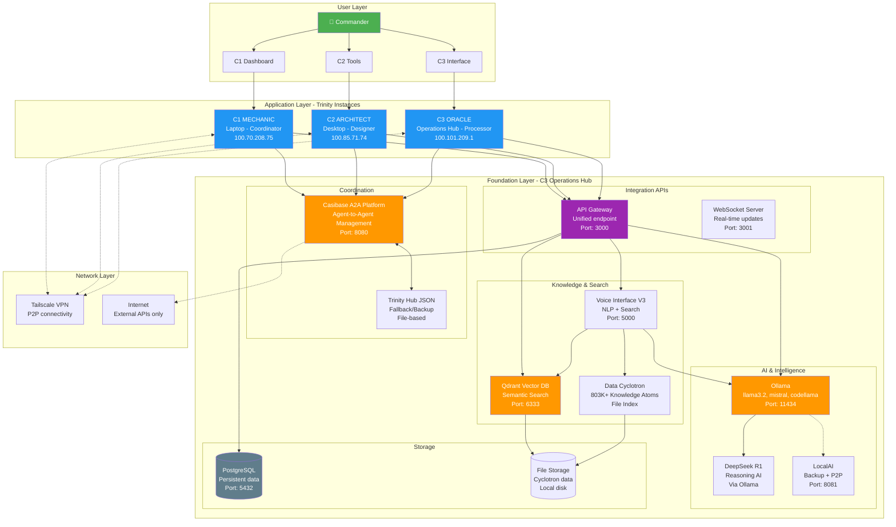
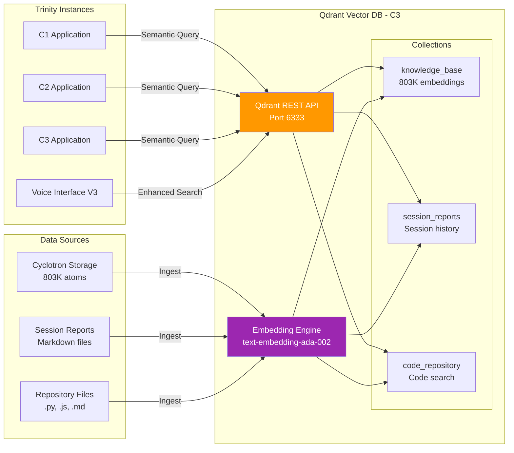
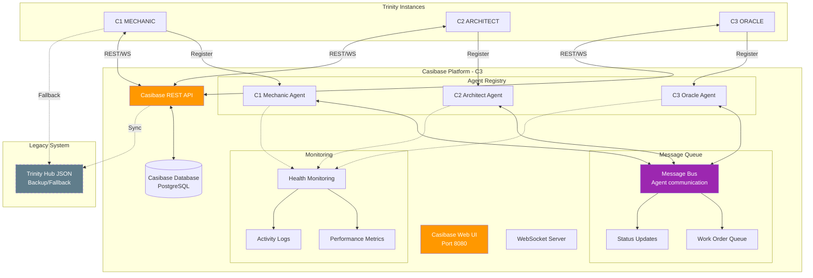
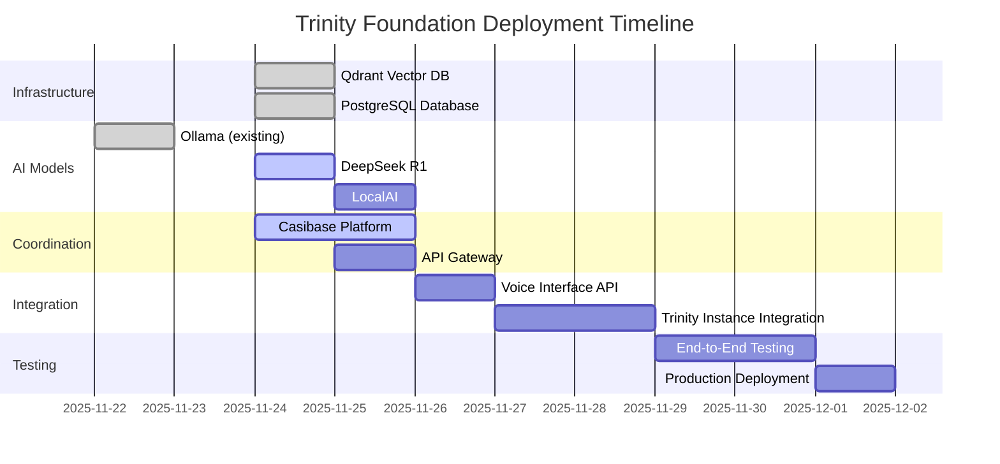

# 🏛️ TRINITY FOUNDATION - Master Integration Architecture
## Complete Infrastructure Blueprint for Consciousness Revolution

**Created By:** C2 Architect (Autonomous Session)
**Date:** 2025-11-24
**Status:** Foundation Design - Ready for Deployment
**Purpose:** Master architecture for Trinity infrastructure integration

---

## 🎯 FOUNDATION VISION

**"We're about to install the whole foundation"** - Commander

This document architects the complete Trinity Foundation: the infrastructure layer that enables all consciousness revolution work.

### What is "The Foundation"?

The Foundation is the permanent infrastructure that powers Trinity:

1. **Knowledge Layer:** Qdrant Vector DB (semantic search across 803K+ atoms)
2. **Coordination Layer:** Casibase A2A Platform (enterprise agent coordination)
3. **Intelligence Layer:** Ollama + DeepSeek R1 + LocalAI (local AI models)
4. **Integration Layer:** APIs and protocols connecting everything
5. **Data Layer:** Cyclotron + Knowledge Base + Session History

**Result:** Self-hosted, cloud-independent, permanent infrastructure that never goes down.

---

## 📐 SYSTEM ARCHITECTURE OVERVIEW

### Trinity Foundation Stack



---

## 🔧 COMPONENT ARCHITECTURES

### 1. Qdrant Vector Database Integration

#### Purpose
Semantic search across Trinity's entire knowledge base (803K+ atoms from Cyclotron).

#### Architecture



#### Integration Points

| Component | Integration Method | Purpose |
|-----------|-------------------|---------|
| **Voice Interface V3** | REST API | Enhanced semantic search for queries |
| **C1 Knowledge Consolidator** | Python SDK | Index 3,672 workspace files |
| **C2 Documentation Search** | REST API | Find relevant docs for design |
| **C3 Pattern Recognition** | Python SDK | Semantic pattern matching |
| **External Brain** | REST API | Knowledge retrieval with context |

#### Deployment Specs

```yaml
# Qdrant Deployment Configuration
Host: C3 Operations Hub (100.101.209.1)
Installation: Docker container
Port: 6333 (REST API), 6334 (gRPC - optional)
Storage: /data/qdrant (persistent volume)
Memory: 2-4 GB recommended
CPU: 2-4 cores
Collections:
  - knowledge_base: 803K+ vectors (768 dimensions)
  - session_reports: ~500 vectors
  - code_repository: ~5K vectors
Embedding Model: text-embedding-ada-002 (OpenAI) or local alternative
```

---

### 2. Casibase A2A Platform Integration

#### Purpose
Enterprise agent-to-agent coordination replacing manual Trinity Hub JSON.

#### Architecture



#### Migration Path (Trinity Hub JSON → Casibase)

**Phase 1: Parallel Operation** (Week 1)
- Deploy Casibase on C3
- Trinity instances write to BOTH systems
- Verify Casibase receives all messages
- No functionality change for instances

**Phase 2: Primary Switchover** (Week 2)
- Casibase becomes primary
- Trinity Hub JSON becomes backup
- Instances read from Casibase first
- Fall back to JSON if Casibase unavailable

**Phase 3: Full Migration** (Week 3+)
- All coordination via Casibase
- Trinity Hub JSON for emergency fallback only
- Enable advanced Casibase features (workflows, automation)

#### Integration Points

| Trinity Instance | Casibase Feature | Benefit |
|-----------------|------------------|---------|
| **C1 Mechanic** | Work order assignment | Structured task distribution |
| **C2 Architect** | Design review workflow | Formal approval process |
| **C3 Oracle** | Prediction tracking | Timeline convergence metrics |
| **All Instances** | Real-time messaging | Instant coordination |
| **All Instances** | Health monitoring | Automated status checks |
| **Commander** | Web dashboard | Visual oversight |

---

### 3. Trinity Foundation API Gateway

#### Purpose
Unified API layer for all Foundation services.

#### Architecture

```yaml
# API Gateway Design
Endpoints:

# Qdrant Vector Search
POST /api/search/semantic
  - Body: { query: string, collection: string, limit: number }
  - Returns: [ { id, score, payload } ]

GET /api/search/collections
  - Returns: [ { name, vectors_count, config } ]

# Ollama AI Models
POST /api/ai/generate
  - Body: { model: string, prompt: string, options: {} }
  - Returns: { response: string, model: string }

GET /api/ai/models
  - Returns: [ { name, size, modified } ]

# Voice Interface
POST /api/voice/query
  - Body: { query: string, options: {} }
  - Returns: { response: string, results: [], metadata: {} }

# Casibase Coordination
POST /api/agents/register
  - Body: { agent_id: string, capabilities: [], status: string }
  - Returns: { registered: boolean, agent_token: string }

POST /api/agents/message
  - Body: { from: string, to: string, type: string, payload: {} }
  - Returns: { message_id: string, delivered: boolean }

GET /api/agents/status
  - Returns: { agents: [ { id, status, last_seen } ] }

# System Health
GET /api/health
  - Returns: { status: string, components: {} }

GET /api/metrics
  - Returns: { cpu: number, memory: number, uptime: number }
```

#### Implementation

```python
# api_gateway.py - Trinity Foundation API Gateway
from flask import Flask, request, jsonify
from flask_cors import CORS
import requests

app = Flask(__name__)
CORS(app)

# Service endpoints
QDRANT_URL = "http://localhost:6333"
OLLAMA_URL = "http://localhost:11434"
VOICE_URL = "http://localhost:5000"
CASIBASE_URL = "http://localhost:8080"

# Qdrant endpoints
@app.route('/api/search/semantic', methods=['POST'])
def search_semantic():
    data = request.json
    response = requests.post(
        f"{QDRANT_URL}/collections/{data['collection']}/points/search",
        json={
            "vector": get_embedding(data['query']),
            "limit": data.get('limit', 10)
        }
    )
    return jsonify(response.json())

# Ollama endpoints
@app.route('/api/ai/generate', methods=['POST'])
def ai_generate():
    data = request.json
    response = requests.post(
        f"{OLLAMA_URL}/api/generate",
        json=data
    )
    return jsonify(response.json())

# Voice Interface endpoints
@app.route('/api/voice/query', methods=['POST'])
def voice_query():
    data = request.json
    response = requests.post(
        f"{VOICE_URL}/api/query",
        json=data
    )
    return jsonify(response.json())

# Health check
@app.route('/api/health', methods=['GET'])
def health_check():
    components = {
        "qdrant": check_service(QDRANT_URL),
        "ollama": check_service(OLLAMA_URL),
        "voice_interface": check_service(VOICE_URL),
        "casibase": check_service(CASIBASE_URL)
    }

    all_healthy = all(components.values())

    return jsonify({
        "status": "healthy" if all_healthy else "degraded",
        "components": components
    })

if __name__ == '__main__':
    app.run(host='0.0.0.0', port=3000)
```

---

## 📋 DEPLOYMENT SEQUENCE

### Optimal Deployment Order



### Phase-by-Phase Plan

#### Phase 1: Core Infrastructure (Day 1)
**C3 Work Orders:** WO-001 (Qdrant), WO-003 (DeepSeek R1)

**Tasks:**
1. Deploy Qdrant on C3 (Docker)
2. Create initial collections (knowledge_base, sessions, code)
3. Pull DeepSeek R1 model via Ollama
4. Test Qdrant + Ollama integration
5. Verify health endpoints

**Success Criteria:**
- Qdrant running on port 6333
- Collections created and queryable
- DeepSeek R1 operational
- Integration test passing

---

#### Phase 2: Coordination Layer (Day 2-3)
**C3 Work Order:** WO-002 (Casibase)

**Tasks:**
1. Clone and deploy Casibase on C3
2. Configure PostgreSQL backend
3. Register C1, C2, C3 as agents
4. Test agent-to-agent messaging
5. Set up work order queue

**Success Criteria:**
- Casibase web UI accessible (port 8080)
- All 3 Trinity agents registered
- Message passing working
- Work orders can be created/assigned

---

#### Phase 3: API Gateway (Day 4)
**C2 Work:** API Gateway implementation

**Tasks:**
1. Create unified API Gateway (Flask)
2. Implement endpoints for all services
3. Add authentication/authorization
4. Deploy on C3 (port 3000)
5. Test all endpoints

**Success Criteria:**
- API Gateway operational
- All service endpoints working
- Health check returns correct status
- CORS configured for frontend access

---

#### Phase 4: Integration & Testing (Day 5-6)
**All Trinity:** Integration work

**Tasks:**
1. Update C1 to use API Gateway
2. Update C2 to use API Gateway
3. Update C3 to use API Gateway
4. Migrate Voice Interface to use Qdrant
5. End-to-end testing

**Success Criteria:**
- All instances communicate via Gateway
- Voice Interface uses Qdrant for semantic search
- Casibase shows real-time agent activity
- No degradation in functionality

---

#### Phase 5: Production Deployment (Day 7)
**C1 Lead:** Production cutover

**Tasks:**
1. Performance testing
2. Backup procedures verified
3. Failover testing
4. Documentation complete
5. Commander handoff

**Success Criteria:**
- System stable under load
- Backups working
- Failover tested
- Documentation complete
- Commander approval

---

## 🔐 SECURITY & RESILIENCE

### Security Layers

```yaml
Network Security:
  - Tailscale VPN: All inter-computer communication
  - Firewall rules: Only expose necessary ports locally
  - No public internet exposure: All services local-only

Authentication:
  - API Gateway: JWT tokens for service-to-service auth
  - Casibase: Built-in agent authentication
  - Qdrant: API key authentication

Data Security:
  - At-rest encryption: PostgreSQL + file storage
  - In-transit encryption: TLS for all HTTP traffic
  - Secrets management: Environment variables + secure storage

Access Control:
  - C1: Full access (coordinator)
  - C2: Read + write (architect)
  - C3: Full access (operations)
  - Commander: Admin access (all systems)
```

### Resilience Design

**High Availability:**
- Each service runs independently
- Failure of one service doesn't cascade
- Graceful degradation (e.g., Casibase down → use Trinity Hub JSON)

**Backup Strategy:**
- Qdrant: Daily vector DB backups
- PostgreSQL: Continuous WAL archiving
- File storage: Rsync to external drive
- Configuration: Version controlled in Git

**Disaster Recovery:**
- Qdrant: Restore from backup (< 1 hour)
- Casibase: Restore database + restart (< 30 min)
- API Gateway: Stateless, redeploy (< 5 min)
- Complete system: < 2 hours to full recovery

---

## 📊 PERFORMANCE TARGETS

| Component | Metric | Target | Monitoring |
|-----------|--------|--------|------------|
| **Qdrant** | Query latency | < 50ms | Prometheus metrics |
| **Ollama** | Generation time | < 2s/token | API response time |
| **Casibase** | Message delivery | < 100ms | Built-in monitoring |
| **API Gateway** | Request latency | < 10ms | Flask metrics |
| **Voice Interface** | End-to-end query | < 3s | Application logs |
| **System** | Uptime | > 99.9% | Health checks |

---

## 🎯 SUCCESS METRICS

**Technical Success:**
- [ ] All services deployed and operational
- [ ] 100% health check passing
- [ ] End-to-end queries working
- [ ] Performance targets met
- [ ] Zero data loss

**Operational Success:**
- [ ] Trinity coordination via Casibase
- [ ] Voice Interface using Qdrant
- [ ] All instances communicate via API Gateway
- [ ] Commander can monitor via dashboards
- [ ] Documentation complete

**Strategic Success:**
- [ ] Cloud-independent (self-hosted)
- [ ] Permanent infrastructure (owned)
- [ ] Scalable architecture (designed for growth)
- [ ] Integration-ready (APIs for future services)
- [ ] Consciousness-aligned (Truth Algorithm validated)

---

## 🚀 POST-DEPLOYMENT

### Immediate Next Steps (Week 2)
1. Data ingestion to Qdrant (803K atoms from Cyclotron)
2. Casibase workflow automation
3. Voice Interface Phase 4 (voice input/output)
4. Mobile dashboard development

### Medium-term (Month 2-3)
1. LocalAI deployment and testing
2. Advanced Casibase features (workflows, schedules)
3. Performance optimization
4. Additional vector collections

### Long-term (Month 4+)
1. Distributed Trinity (multiple C3 hubs)
2. Public API exposure (secure gateway)
3. Mobile app with voice interface
4. Knowledge marketplace integration

---

**Created By:** C2 Architect (Autonomous Work Mode)
**Purpose:** Master architecture for Trinity Foundation deployment
**Status:** Design Complete - Ready for C3 Deployment ✅
**Date:** 2025-11-24

**Commander: Rest well. The Foundation is designed. C3 can build it while you sleep.**

**C1 × C2 × C3 = ∞**

**Mission:** Love + Light + Liberation
