# 🏗️ Voice Interface V3 - Architecture Diagrams
## Visual System Architecture & Data Flow

**Created By:** C2 Architect
**Date:** 2025-11-24
**Version:** Voice Interface Phase 3 (Production)
**Purpose:** Visual documentation of system architecture for developers and stakeholders

---

## 📐 Diagram 1: System Architecture Overview

### High-Level Component Flow

```mermaid
graph TB
    subgraph "User Layer"
        USER[👤 User]
        CLI[Command Line Interface]
        API[REST API - Future]
        WEBAPP[Web Interface - Future]
    end

    subgraph "Voice Interface V3 Core"
        CONFIG[Configuration Manager<br/>Cross-platform paths<br/>Environment detection]
        LOGGER[Logging System<br/>File + Console<br/>Query history]

        subgraph "Processing Pipeline"
            NLP[NLP Query Processor<br/>Intent detection<br/>Category classification<br/>Time-range parsing]
            SEARCH[Enhanced Cyclotron Search<br/>Multi-parameter filtering<br/>Relevance scoring<br/>Result ranking]
        end

        FALLBACK[Fallback Handler<br/>Graceful degradation<br/>Error recovery]
    end

    subgraph "Knowledge Layer"
        KB[Knowledge Base<br/>159+ documents indexed<br/>Metadata extraction]
        FILES[(Repository Files<br/>.md .json .py .js .txt)]
        STORAGE[(Data Cyclotron Storage<br/>Optional external storage)]
    end

    subgraph "Optional Integrations"
        OPENAI[OpenAI API<br/>Enhanced responses<br/>GPT-4 processing]
        OVERKORE[OVERKORE System<br/>Pattern Theory<br/>Trinity Coordination]
    end

    %% Main Flow
    USER -->|Query| CLI
    CLI --> CONFIG
    CONFIG --> NLP
    NLP -->|Parsed Query| SEARCH
    SEARCH -->|Search| KB
    KB -->|Load| FILES
    KB -->|Load| STORAGE
    SEARCH -->|Results| CLI
    CLI -->|Response| USER

    %% Logging
    CLI -.->|Log| LOGGER
    NLP -.->|Log| LOGGER
    SEARCH -.->|Log| LOGGER

    %% Fallback
    NLP -->|Error| FALLBACK
    SEARCH -->|Error| FALLBACK
    FALLBACK -->|Basic Response| CLI

    %% Optional
    NLP -.->|Enhanced| OPENAI
    SEARCH -.->|Integrate| OVERKORE

    %% Future
    USER -.->|Future| API
    USER -.->|Future| WEBAPP
    API -.->|Future| CONFIG
    WEBAPP -.->|Future| CONFIG

    style USER fill:#4CAF50,color:#fff
    style CLI fill:#2196F3,color:#fff
    style NLP fill:#FF9800,color:#fff
    style SEARCH fill:#FF9800,color:#fff
    style KB fill:#9C27B0,color:#fff
    style CONFIG fill:#607D8B,color:#fff
    style LOGGER fill:#607D8B,color:#fff
    style FALLBACK fill:#F44336,color:#fff
    style OPENAI fill:#00BCD4,color:#fff,stroke-dasharray: 5 5
    style OVERKORE fill:#00BCD4,color:#fff,stroke-dasharray: 5 5
    style API fill:#9E9E9E,color:#fff,stroke-dasharray: 5 5
    style WEBAPP fill:#9E9E9E,color:#fff,stroke-dasharray: 5 5
```



### Component Descriptions

| Component | Responsibility | Status |
|-----------|---------------|--------|
| **Configuration Manager** | Platform detection, path resolution, environment setup | ✅ Production |
| **NLP Query Processor** | Natural language understanding, intent classification | ✅ Production |
| **Enhanced Cyclotron Search** | Multi-parameter search, relevance ranking, filtering | ✅ Production |
| **Knowledge Base** | Document indexing, metadata extraction, category detection | ✅ Production |
| **Logging System** | Activity logging, query history, error tracking | ✅ Production |
| **Fallback Handler** | Graceful degradation when components unavailable | ✅ Production |
| **OpenAI Integration** | Enhanced responses via GPT-4 (optional) | ⚠️ Optional |
| **OVERKORE Integration** | Pattern Theory, Trinity coordination (future) | 🔜 Planned |
| **REST API** | Programmatic access for web/mobile | 🔜 Phase 4 |
| **Web Interface** | Browser-based UI for Voice Interface | 🔜 Phase 4 |

---

## 🔄 Diagram 2: Data Flow - Query Processing Pipeline

### Complete Query Lifecycle


### Data Flow Metrics

**Phase 1: Initialization**
- Knowledge base indexing: ~1-3 seconds
- Files processed: 159+ documents
- Metadata extracted: file type, modified date, size, category, source

**Phase 2: Query Processing**
- NLP processing time: ~5-15ms
- Intent detection: 7 types (search, explain, summarize, compare, recommend, count, default)
- Category detection: 10 categories
- Time parsing: Supports relative ("last month") and absolute ("October") formats

**Phase 3: Search Execution**
- Search strategies: 6 types (keyword, temporal, filtered, category, aggregation, multi-query)
- Average search time: ~10-30ms
- Relevance scoring: Weighted by keyword match frequency
- Result ranking: Top 10 by default (configurable)

**Phase 4: Response Generation**
- Fallback mode: Direct result formatting (~5ms)
- OpenAI enhanced: ~500-1500ms (API call overhead)
- Total end-to-end: 50-2000ms depending on mode

---

## 🚀 Diagram 3: Deployment Architecture

### Cross-Platform Deployment Options

```mermaid
graph TB
    subgraph "Computer 1 (PC1) - Laptop<br/>dwrekscpu @ 100.70.208.75"
        PC1_OS[Windows 11]
        PC1_VOICE[Voice Interface V3<br/>Local Mode]
        PC1_STORAGE[("C:/Users/dwrek/<br/>DATA_CYCLOTRON_STORAGE")]
        PC1_REPO[("Repository<br/>philosopher-ai-backend")]

        PC1_OS --> PC1_VOICE
        PC1_VOICE --> PC1_STORAGE
        PC1_VOICE --> PC1_REPO
    end

    subgraph "Computer 3 (PC3) - Operations Hub<br/>desktop-s72lrro @ 100.101.209.1"
        PC3_OS[Windows 11]
        PC3_VOICE[Voice Interface V3<br/>Full Mode]
        PC3_STORAGE[("C:/Users/Darrick/<br/>DATA_CYCLOTRON_STORAGE")]
        PC3_REPO[("Repository<br/>philosopher-ai-backend")]
        PC3_TRINITY[Trinity Integration<br/>OVERKORE System]

        PC3_OS --> PC3_VOICE
        PC3_VOICE --> PC3_STORAGE
        PC3_VOICE --> PC3_REPO
        PC3_VOICE --> PC3_TRINITY
    end

    subgraph "Cloud Deployment (Railway/Future)"
        CLOUD_OS[Linux (Ubuntu/Debian)]
        CLOUD_VOICE[Voice Interface V3<br/>API Mode]
        CLOUD_STORAGE[("./data/<br/>knowledge_base")]
        CLOUD_DB[(PostgreSQL<br/>Future persistent storage)]
        CLOUD_API[REST API Server<br/>Phase 4]

        CLOUD_OS --> CLOUD_VOICE
        CLOUD_VOICE --> CLOUD_STORAGE
        CLOUD_VOICE --> CLOUD_DB
        CLOUD_VOICE --> CLOUD_API
    end

    subgraph "Shared Services"
        OPENAI_CLOUD[OpenAI API<br/>gpt-4, embeddings]
        GITHUB[GitHub Repository<br/>Version control + sync]
        TAILSCALE[Tailscale Network<br/>P2P connectivity]
    end

    PC1_VOICE -.->|Optional| OPENAI_CLOUD
    PC3_VOICE -.->|Optional| OPENAI_CLOUD
    CLOUD_VOICE -.->|Optional| OPENAI_CLOUD

    PC1_REPO -.->|Sync| GITHUB
    PC3_REPO -.->|Sync| GITHUB
    CLOUD_STORAGE -.->|Sync| GITHUB

    PC1_VOICE -.->|Network| TAILSCALE
    PC3_VOICE -.->|Network| TAILSCALE
    TAILSCALE -.->|Future| CLOUD_API

    style PC1_OS fill:#4CAF50,color:#fff
    style PC3_OS fill:#4CAF50,color:#fff
    style CLOUD_OS fill:#2196F3,color:#fff
    style PC1_VOICE fill:#FF9800,color:#fff
    style PC3_VOICE fill:#FF9800,color:#fff
    style CLOUD_VOICE fill:#FF9800,color:#fff
    style OPENAI_CLOUD fill:#00BCD4,color:#fff,stroke-dasharray: 5 5
    style GITHUB fill:#9C27B0,color:#fff
    style TAILSCALE fill:#607D8B,color:#fff,stroke-dasharray: 5 5
```

### Deployment Configurations

#### PC1 (Laptop) - Local Mode
```yaml
Platform: Windows 11
Role: Coordinator (C1 Mechanic)
Mode: Local CLI usage
Storage: C:/Users/dwrek/DATA_CYCLOTRON_STORAGE
Features:
  - Basic voice queries
  - Local knowledge access
  - Lightweight operation (laptop optimization)
  - OpenAI optional (for enhanced responses)
Resources:
  - CPU: Intel i5/i7 (laptop)
  - RAM: 8-16 GB
  - Disk: SSD, ~50GB available
```

#### PC3 (Operations Hub) - Full Mode
```yaml
Platform: Windows 11
Role: Heavy Processing (C3 Oracle)
Mode: Full system with Trinity integration
Storage: C:/Users/Darrick/DATA_CYCLOTRON_STORAGE (primary)
Features:
  - Full voice interface
  - Large knowledge base (803K+ atoms via Cyclotron)
  - Trinity coordination (OVERKORE integration)
  - OpenAI enabled
  - Background autonomous work
Resources:
  - CPU: Intel i7/i9 (desktop)
  - RAM: 16-32 GB
  - Disk: SSD, ~200GB available
```

#### Cloud (Railway/Future) - API Mode
```yaml
Platform: Linux (Ubuntu 22.04 LTS)
Role: API Server
Mode: REST API for web/mobile clients
Storage: ./data/knowledge_base (volume mounted)
Features:
  - REST API endpoints
  - Multi-user support
  - PostgreSQL integration (future)
  - Horizontal scaling ready
  - WebSocket support (future)
Resources:
  - CPU: 2-4 vCPUs
  - RAM: 2-4 GB
  - Disk: 10-50 GB
  - Network: Public endpoint with HTTPS
```

### Network Architecture


---

## 🔧 Diagram 4: Error Handling & Fallback System

### Graceful Degradation Flow

```mermaid
graph TB
    START[System Start]

    START --> CHECK_NLP{NLP Processor<br/>Available?}
    CHECK_NLP -->|Yes| NLP_MODE[Full NLP Mode<br/>Intent + Categories + Time]
    CHECK_NLP -->|No| BASIC_MODE[Basic Mode<br/>Keyword search only]

    NLP_MODE --> CHECK_SEARCH{Enhanced Search<br/>Available?}
    BASIC_MODE --> CHECK_SEARCH

    CHECK_SEARCH -->|Yes| SEARCH_MODE[Full Search Mode<br/>Multi-parameter filtering]
    CHECK_SEARCH -->|No| FALLBACK_SEARCH[Fallback Search<br/>Simple glob patterns]

    SEARCH_MODE --> CHECK_OPENAI{OpenAI API<br/>Available?}
    FALLBACK_SEARCH --> CHECK_OPENAI

    CHECK_OPENAI -->|Yes| ENHANCED_RESPONSE[Enhanced Responses<br/>GPT-4 formatting]
    CHECK_OPENAI -->|No| BASIC_RESPONSE[Basic Responses<br/>Direct formatting]

    ENHANCED_RESPONSE --> SUCCESS[✅ Response Delivered]
    BASIC_RESPONSE --> SUCCESS

    NLP_MODE -.->|Error| ERROR_NLP[NLP Error Handler]
    SEARCH_MODE -.->|Error| ERROR_SEARCH[Search Error Handler]
    ENHANCED_RESPONSE -.->|Error| ERROR_API[API Error Handler]

    ERROR_NLP --> BASIC_MODE
    ERROR_SEARCH --> FALLBACK_SEARCH
    ERROR_API --> BASIC_RESPONSE

    style START fill:#4CAF50,color:#fff
    style SUCCESS fill:#4CAF50,color:#fff
    style NLP_MODE fill:#2196F3,color:#fff
    style SEARCH_MODE fill:#2196F3,color:#fff
    style ENHANCED_RESPONSE fill:#2196F3,color:#fff
    style BASIC_MODE fill:#FF9800,color:#fff
    style FALLBACK_SEARCH fill:#FF9800,color:#fff
    style BASIC_RESPONSE fill:#FF9800,color:#fff
    style ERROR_NLP fill:#F44336,color:#fff
    style ERROR_SEARCH fill:#F44336,color:#fff
    style ERROR_API fill:#F44336,color:#fff
```



### Fallback Modes

| Scenario | Fallback Behavior | Impact |
|----------|------------------|--------|
| **NLP unavailable** | Use basic keyword extraction | ⚠️ No intent detection, reduced query understanding |
| **Search engine unavailable** | Use glob patterns + grep | ⚠️ No relevance ranking, slower performance |
| **OpenAI unavailable** | Direct result formatting | ⚠️ Less natural responses, raw data display |
| **Knowledge base empty** | Return helpful error message | ❌ No results (user prompted to check paths) |
| **All components unavailable** | System refuses to start | ❌ Critical failure (logs written, user notified) |

### Error Recovery Examples

**Example 1: NLP Module Missing**
```
[WARNING] NLP Processor not available - using basic search
Query: "What frameworks did we build last month?"
→ Fallback: Extract keywords ["frameworks", "build", "last", "month"]
→ Search: Basic keyword matching only
→ Result: Returns all docs with "frameworks" (no time filtering)
```

**Example 2: OpenAI API Key Missing**
```
[WARNING] OpenAI not available - using fallback responses
Query: "Summarize Trinity system"
→ Search: Normal (NLP + Enhanced Search work)
→ Response: Direct JSON/text output (no GPT-4 summarization)
→ Result: User gets raw results, functional but less polished
```

**Example 3: Knowledge Base Not Found**
```
[ERROR] Knowledge base path not found: C:/Users/Darrick/DATA_CYCLOTRON_STORAGE
→ Fallback: Use repository path (current directory)
→ Index: Scans local .md, .json, .py files only
→ Result: Reduced knowledge (repo only, ~159 docs vs 803K atoms)
```

---

## 📊 Performance Architecture

### System Resource Usage


### Performance Benchmarks (Actual)

```
System Initialization:    1,474 queries/sec  (~0.7ms per init)
Simple Query Processing:    270 queries/sec  (~3.7ms per query)
Complex Query Processing:   264 queries/sec  (~3.8ms per query)
Category-Filtered Query:    498 queries/sec  (~2.0ms per query)

Average Response Time: 3.8ms
Median Response Time:  3.6ms
95th Percentile:       <5ms

Knowledge Base Size:   159+ documents indexed
Search Coverage:       .md, .json, .py, .js, .txt files
Memory Footprint:      ~50MB (after initialization)
```

---

## 🔮 Future Architecture (Phase 4+)

### Phase 4: Voice Input/Output Architecture

```mermaid
graph TB
    subgraph "Phase 4 Components (To Be Built)"
        WAKE[Wake Word Detector<br/>Porcupine/Picovoice]
        MIC[Audio Input Handler<br/>PyAudio/SoundDevice]
        STT[Speech-to-Text<br/>Whisper (local/cloud)]
        TTS[Text-to-Speech<br/>pyttsx3/ElevenLabs]
        SPEAKER[Audio Output Handler<br/>PyAudio/SoundDevice]
    end

    subgraph "Existing Phase 3 (Current)"
        V3[Voice Interface V3<br/>Text processing]
        NLP_V3[NLP Processor]
        SEARCH_V3[Enhanced Search]
    end

    USER[👤 User]

    USER -->|Speech| WAKE
    WAKE -->|Wake word detected| MIC
    MIC -->|Audio stream| STT
    STT -->|Text query| V3
    V3 --> NLP_V3
    NLP_V3 --> SEARCH_V3
    SEARCH_V3 -->|Results| V3
    V3 -->|Text response| TTS
    TTS -->|Audio stream| SPEAKER
    SPEAKER -->|Speech| USER

    style WAKE fill:#9E9E9E,color:#fff,stroke-dasharray: 5 5
    style MIC fill:#9E9E9E,color:#fff,stroke-dasharray: 5 5
    style STT fill:#9E9E9E,color:#fff,stroke-dasharray: 5 5
    style TTS fill:#9E9E9E,color:#fff,stroke-dasharray: 5 5
    style SPEAKER fill:#9E9E9E,color:#fff,stroke-dasharray: 5 5
    style V3 fill:#2196F3,color:#fff
    style NLP_V3 fill:#FF9800,color:#fff
    style SEARCH_V3 fill:#FF9800,color:#fff
```

**Phase 4 Roadmap:**
- Phase 4.1: Basic STT/TTS integration (Whisper + pyttsx3)
- Phase 4.2: Wake word detection (Porcupine or custom)
- Phase 4.3: Always-on listening mode
- Phase 4.4: Production optimization (latency, accuracy)

---

## 📚 References

**Implementation Files:**
- `voice_interface_v3_production.py` - Main system (560 lines)
- `nlp_query_processor.py` - NLP component (369 lines)
- `enhanced_cyclotron_search.py` - Search engine (343 lines)
- `test_voice_interface_v3.py` - Test suite (110 lines)

**Documentation Files:**
- `VOICE_INTERFACE_PHASE_3_COMPLETE.md` - Phase 3 summary
- `AUTONOMOUS_WORK_SESSION_3_COMPLETE.md` - Session details
- `OVERKORE_ANATOMICAL_MAP.md` - System integration context

**Architecture Notes:**
- All diagrams use Mermaid syntax (render in GitHub, GitLab, or Mermaid Live Editor)
- Dashed lines (-.-> or stroke-dasharray) indicate optional or future components
- Colors: Green (user/success), Blue (core), Orange (processing), Purple (data), Red (errors), Gray (future)

---

**Created By:** C2 Architect (The Mind)
**Purpose:** Design what SHOULD scale
**Status:** Production Documentation ✅
**Date:** 2025-11-24

**C1 × C2 × C3 = ∞**
