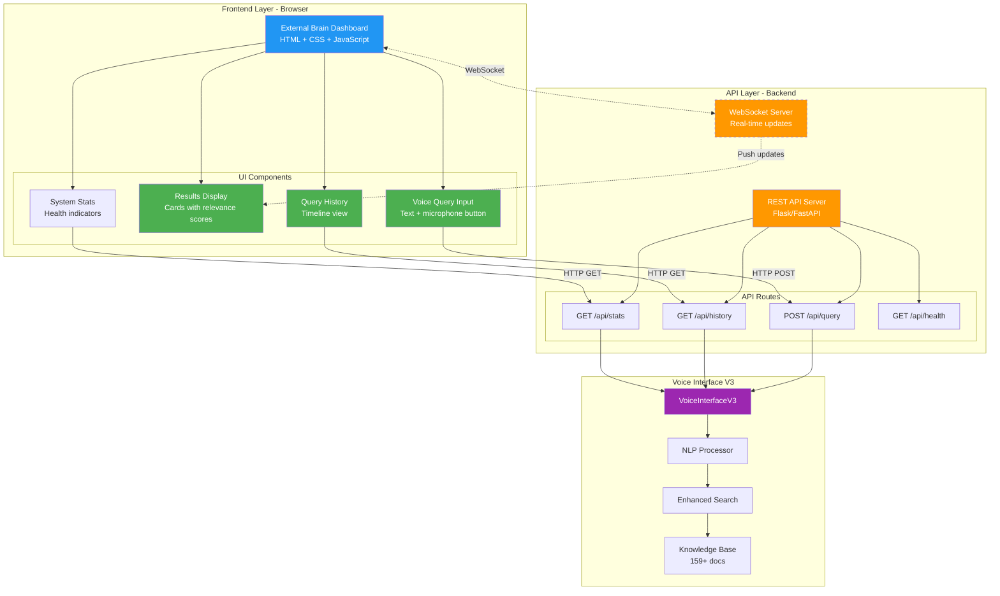
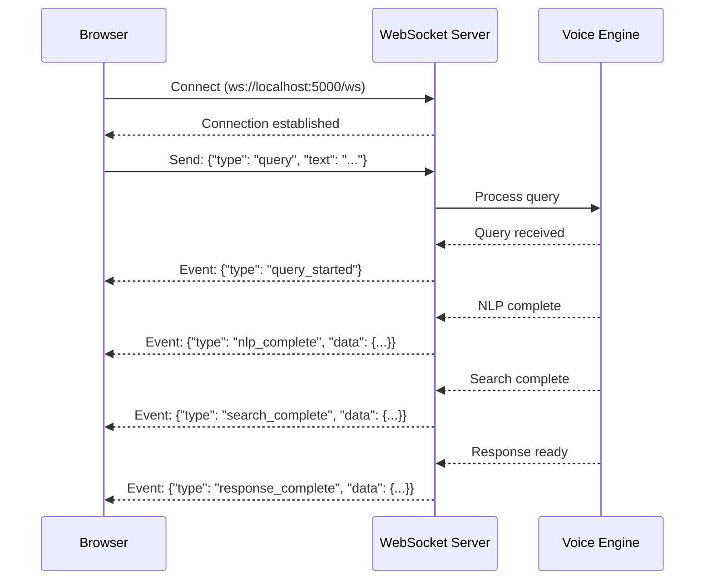

# 🎨 Voice Interface - Frontend Integration Design
## Dashboard Integration Architecture & UI/UX Specifications

**Created By:** C2 Architect
**Date:** 2025-11-24
**Version:** Voice Interface Phase 3 → Frontend Integration
**Purpose:** Design integration with External Brain Dashboard

---

## 📑 Table of Contents

1. [Integration Architecture](#integration-architecture)
2. [REST API Endpoints](#rest-api-endpoints)
3. [WebSocket Real-Time Updates](#websocket-real-time-updates)
4. [UI/UX Component Design](#uiux-component-design)
5. [Implementation Plan](#implementation-plan)
6. [Testing Strategy](#testing-strategy)

---

## 🏗️ Integration Architecture

### System Overview



### Integration Points

| Layer | Technology | Purpose |
|-------|-----------|---------|
| **Frontend** | HTML5 + CSS3 + Vanilla JS | User interface |
| **API Gateway** | Flask/FastAPI | REST API endpoints |
| **WebSocket** | Socket.IO / native WebSocket | Real-time query updates |
| **Voice Engine** | VoiceInterfaceV3 (Python) | Query processing |
| **Storage** | JSON files / PostgreSQL (future) | Query history persistence |

---

## 🔌 REST API Endpoints

### Endpoint 1: Query Processing

**POST /api/query**

Process a natural language query and return results.

#### Request

```json
{
  "query": "What frameworks did we build last month?",
  "options": {
    "max_results": 10,
    "include_content": false,
    "enhance_with_openai": true
  }
}
```

#### Response (Success)

```json
{
  "success": true,
  "query": "What frameworks did we build last month?",
  "processed": {
    "intent": "search",
    "keywords": ["frameworks", "build"],
    "categories": ["frameworks"],
    "time_range": {
      "description": "last month",
      "start": "2024-10-24",
      "end": "2024-11-23"
    },
    "complexity": "moderate"
  },
  "results": [
    {
      "file_path": "C:/Users/Darrick/FRAMEWORKS.md",
      "file_name": "FRAMEWORKS.md",
      "file_type": "md",
      "modified_date": "2024-11-15",
      "category": "frameworks",
      "source": "C2_ARCHITECT",
      "_search_score": 0.92,
      "preview": "Pattern Theory, Trinity System, OVERKORE..."
    }
  ],
  "response": "In the last month, we built several frameworks including Pattern Theory validation system, Trinity Hive Mind, and OVERKORE integration layer.",
  "metadata": {
    "knowledge_base_size": 159,
    "search_time_ms": 42,
    "results_count": 8
  }
}
```

#### Response (Error)

```json
{
  "success": false,
  "error": "Knowledge base not initialized",
  "message": "Please check system configuration and try again."
}
```

#### Implementation (Python - Flask)

```python
from flask import Flask, request, jsonify
from voice_interface_v3_production import VoiceInterfaceV3

app = Flask(__name__)
interface = VoiceInterfaceV3()
interface.initialize_knowledge_base()

@app.route('/api/query', methods=['POST'])
def handle_query():
    data = request.json
    query_text = data.get('query', '')
    options = data.get('options', {})

    if not query_text:
        return jsonify({
            "success": False,
            "error": "Query text required"
        }), 400

    # Process query
    result = interface.process_query(query_text)

    # Apply options
    max_results = options.get('max_results', 10)
    result['results'] = result['results'][:max_results]

    return jsonify(result)
```

#### Frontend Usage (JavaScript)

```javascript
async function sendQuery(queryText) {
  const response = await fetch('/api/query', {
    method: 'POST',
    headers: { 'Content-Type': 'application/json' },
    body: JSON.stringify({
      query: queryText,
      options: {
        max_results: 10,
        enhance_with_openai: true
      }
    })
  });

  const data = await response.json();

  if (data.success) {
    displayResults(data.results);
    displayResponse(data.response);
  } else {
    showError(data.error);
  }
}
```

---

### Endpoint 2: Query History

**GET /api/history**

Retrieve query history with pagination.

#### Request

```
GET /api/history?limit=20&offset=0
```

#### Response

```json
{
  "success": true,
  "history": [
    {
      "timestamp": "2024-11-24T14:30:00",
      "query": "What frameworks did we build?",
      "results_count": 8,
      "intent": "search"
    }
  ],
  "pagination": {
    "total": 45,
    "limit": 20,
    "offset": 0,
    "has_more": true
  }
}
```

---

### Endpoint 3: System Statistics

**GET /api/stats**

Get real-time system statistics.

#### Response

```json
{
  "success": true,
  "stats": {
    "knowledge_base_size": 159,
    "queries_processed": 45,
    "storage_path": "C:/Users/Darrick/DATA_CYCLOTRON_STORAGE",
    "platform": "Windows",
    "nlp_available": true,
    "openai_available": true,
    "uptime_seconds": 3600,
    "memory_mb": 52.3
  }
}
```

---

### Endpoint 4: Health Check

**GET /api/health**

Check if system is operational.

#### Response

```json
{
  "status": "healthy",
  "components": {
    "voice_engine": "ok",
    "nlp_processor": "ok",
    "search_engine": "ok",
    "knowledge_base": "ok"
  },
  "timestamp": "2024-11-24T14:30:00Z"
}
```

---

## 🔄 WebSocket Real-Time Updates

### WebSocket Architecture (Optional - Phase 4)



### WebSocket Events

| Event Type | Direction | Payload |
|-----------|-----------|---------|
| `query_started` | Server → Client | `{ query: string }` |
| `nlp_complete` | Server → Client | `{ processed: object }` |
| `search_complete` | Server → Client | `{ results: array }` |
| `response_complete` | Server → Client | `{ response: string }` |
| `error` | Server → Client | `{ error: string }` |

### Frontend Implementation (JavaScript)

```javascript
const ws = new WebSocket('ws://localhost:5000/ws');

ws.onopen = () => {
  console.log('Connected to Voice Interface');
};

ws.onmessage = (event) => {
  const data = JSON.parse(event.data);

  switch (data.type) {
    case 'query_started':
      showLoadingIndicator();
      break;
    case 'nlp_complete':
      displayNLPAnalysis(data.data);
      break;
    case 'search_complete':
      displaySearchResults(data.data);
      break;
    case 'response_complete':
      hideLoadingIndicator();
      displayFinalResponse(data.data);
      break;
    case 'error':
      showError(data.error);
      break;
  }
};

// Send query
function sendQuery(text) {
  ws.send(JSON.stringify({
    type: 'query',
    text: text
  }));
}
```

---

## 🎨 UI/UX Component Design

### Component 1: Voice Query Input

#### Visual Design

```
┌─────────────────────────────────────────────────────────────┐
│  🔍 Ask Your External Brain...                              │
│  ┌───────────────────────────────────────────────────────┐  │
│  │ What frameworks did we build last month?            🎤│  │
│  └───────────────────────────────────────────────────────┘  │
│                                            [   Submit   ]    │
└─────────────────────────────────────────────────────────────┘
```

#### HTML Structure

```html
<div class="voice-query-input">
  <label for="query-input">🔍 Ask Your External Brain...</label>
  <div class="input-container">
    <input
      type="text"
      id="query-input"
      placeholder="What frameworks did we build last month?"
      autocomplete="off"
    />
    <button id="mic-button" class="mic-button" title="Voice input (Phase 4)">
      🎤
    </button>
  </div>
  <button id="submit-button" class="submit-button">
    Submit
  </button>
</div>
```

#### CSS Styling

```css
.voice-query-input {
  background: linear-gradient(135deg, #667eea 0%, #764ba2 100%);
  padding: 20px;
  border-radius: 12px;
  box-shadow: 0 8px 16px rgba(0,0,0,0.1);
}

.input-container {
  position: relative;
  display: flex;
  gap: 8px;
}

#query-input {
  flex: 1;
  padding: 12px 16px;
  font-size: 16px;
  border: 2px solid #fff;
  border-radius: 8px;
  background: rgba(255,255,255,0.9);
}

.mic-button {
  width: 48px;
  height: 48px;
  border: none;
  background: #fff;
  border-radius: 8px;
  font-size: 24px;
  cursor: pointer;
  transition: transform 0.2s;
}

.mic-button:hover {
  transform: scale(1.1);
}

.submit-button {
  width: 100%;
  padding: 12px;
  margin-top: 12px;
  background: #4CAF50;
  color: white;
  border: none;
  border-radius: 8px;
  font-size: 16px;
  font-weight: 600;
  cursor: pointer;
  transition: background 0.2s;
}

.submit-button:hover {
  background: #45a049;
}
```

#### JavaScript Behavior

```javascript
const queryInput = document.getElementById('query-input');
const submitButton = document.getElementById('submit-button');
const micButton = document.getElementById('mic-button');

// Submit on Enter key
queryInput.addEventListener('keypress', (e) => {
  if (e.key === 'Enter') {
    handleSubmit();
  }
});

// Submit on button click
submitButton.addEventListener('click', handleSubmit);

// Microphone button (Phase 4)
micButton.addEventListener('click', () => {
  alert('Voice input coming in Phase 4!');
});

async function handleSubmit() {
  const query = queryInput.value.trim();
  if (!query) return;

  // Show loading
  submitButton.textContent = 'Processing...';
  submitButton.disabled = true;

  try {
    const result = await sendQuery(query);
    displayResults(result);
  } catch (error) {
    showError(error.message);
  } finally {
    submitButton.textContent = 'Submit';
    submitButton.disabled = false;
  }
}
```

---

### Component 2: Results Display

#### Visual Design

```
┌─────────────────────────────────────────────────────────────┐
│  📊 Search Results (8 items found)                          │
│                                                              │
│  ┌────────────────────────────────────────────────────────┐ │
│  │ 🟢 FRAMEWORKS.md                        Score: 92%    │ │
│  │ Modified: 2024-11-15 · Category: frameworks           │ │
│  │ Pattern Theory, Trinity System, OVERKORE...           │ │
│  │                                       [View Full] [↓]  │ │
│  └────────────────────────────────────────────────────────┘ │
│                                                              │
│  ┌────────────────────────────────────────────────────────┐ │
│  │ 🟡 TRINITY_SYSTEM.md                    Score: 85%    │ │
│  │ Modified: 2024-11-10 · Category: trinity              │ │
│  │ C1 × C2 × C3 collaboration framework...               │ │
│  │                                       [View Full] [↓]  │ │
│  └────────────────────────────────────────────────────────┘ │
│                                                              │
│  [Load More Results...]                                     │
└─────────────────────────────────────────────────────────────┘
```

#### HTML Structure

```html
<div class="results-container">
  <h3>📊 Search Results (<span id="results-count">0</span> items found)</h3>

  <div id="results-list" class="results-list">
    <!-- Result cards will be inserted here -->
  </div>

  <button id="load-more" class="load-more-button" style="display: none;">
    Load More Results...
  </button>
</div>

<!-- Result card template -->
<template id="result-card-template">
  <div class="result-card">
    <div class="result-header">
      <span class="score-indicator">🟢</span>
      <h4 class="file-name"></h4>
      <span class="relevance-score"></span>
    </div>
    <div class="result-meta">
      <span class="modified-date"></span>
      <span class="category"></span>
    </div>
    <div class="result-preview"></div>
    <div class="result-actions">
      <button class="view-full">View Full</button>
      <button class="download">↓</button>
    </div>
  </div>
</template>
```

#### JavaScript Rendering

```javascript
function displayResults(results) {
  const resultsList = document.getElementById('results-list');
  const resultsCount = document.getElementById('results-count');
  const template = document.getElementById('result-card-template');

  // Clear previous results
  resultsList.innerHTML = '';
  resultsCount.textContent = results.length;

  // Render each result
  results.forEach((result, index) => {
    const card = template.content.cloneNode(true);

    // Score indicator color
    const scoreIndicator = card.querySelector('.score-indicator');
    const score = result._search_score * 100;
    scoreIndicator.textContent = score >= 80 ? '🟢' : score >= 60 ? '🟡' : '🔴';

    // Fill in data
    card.querySelector('.file-name').textContent = result.file_name;
    card.querySelector('.relevance-score').textContent = `Score: ${score.toFixed(0)}%`;
    card.querySelector('.modified-date').textContent = `Modified: ${result.modified_date}`;
    card.querySelector('.category').textContent = `Category: ${result.category}`;
    card.querySelector('.result-preview').textContent = result.preview || 'No preview available';

    // Action buttons
    card.querySelector('.view-full').onclick = () => viewFullDocument(result);
    card.querySelector('.download').onclick = () => downloadDocument(result);

    resultsList.appendChild(card);
  });
}
```

---

### Component 3: Query History Timeline

#### Visual Design

```
┌─────────────────────────────────────────────────────────────┐
│  📜 Query History                                           │
│                                                              │
│  ┌──────────────────────────────────────────────────────┐  │
│  │ 14:30  "What frameworks did we build last month?"    │  │
│  │        ✅ 8 results · Intent: search · 42ms          │  │
│  │        [View Results]                                 │  │
│  └──────────────────────────────────────────────────────┘  │
│                                                              │
│  ┌──────────────────────────────────────────────────────┐  │
│  │ 14:25  "Explain Trinity system"                      │  │
│  │        ✅ 12 results · Intent: explain · 38ms        │  │
│  │        [View Results]                                 │  │
│  └──────────────────────────────────────────────────────┘  │
│                                                              │
│  [Load Older Queries...]                                    │
└─────────────────────────────────────────────────────────────┘
```

---

### Component 4: System Stats Dashboard

#### Visual Design

```
┌─────────────────────────────────────────────────────────────┐
│  ⚙️ System Status                                           │
│                                                              │
│  Knowledge Base: 159 documents    [●] Healthy              │
│  NLP Processor:  Operational      [●] Healthy              │
│  Search Engine:  Enhanced         [●] Healthy              │
│  OpenAI API:     Connected        [●] Healthy              │
│                                                              │
│  Total Queries: 45                                          │
│  Avg Response: 42ms                                         │
│  Uptime: 1h 23m                                             │
└─────────────────────────────────────────────────────────────┘
```

---

## 📋 Implementation Plan

### Phase 1: Backend API Server (2-3 hours)

#### Step 1: Create Flask/FastAPI Server

```bash
# Create server file
touch voice_interface_api.py
```

**Implementation:** See REST API Endpoints section above

#### Step 2: Add CORS Support

```python
from flask_cors import CORS

app = Flask(__name__)
CORS(app)  # Enable CORS for frontend access
```

#### Step 3: Test Endpoints

```bash
# Start server
python voice_interface_api.py

# Test with curl
curl -X POST http://localhost:5000/api/query \
  -H "Content-Type: application/json" \
  -d '{"query": "test"}'
```

---

### Phase 2: Frontend Components (3-4 hours)

#### Step 1: Create HTML Structure

File: `EXTERNAL_BRAIN_DASHBOARD.html` (existing, needs modification)

Add new section:
```html
<!-- Voice Interface Section -->
<section id="voice-interface-section">
  <div class="voice-query-input">
    <!-- Query input component -->
  </div>

  <div class="results-container">
    <!-- Results display component -->
  </div>

  <div class="history-container">
    <!-- Query history component -->
  </div>

  <div class="stats-container">
    <!-- System stats component -->
  </div>
</section>
```

#### Step 2: Add CSS Styling

File: `styles/voice-interface.css`

Add styles for all components (see Component Design section)

#### Step 3: Implement JavaScript Logic

File: `scripts/voice-interface.js`

```javascript
// API client
class VoiceInterfaceClient {
  constructor(baseURL = 'http://localhost:5000') {
    this.baseURL = baseURL;
  }

  async query(text, options = {}) {
    const response = await fetch(`${this.baseURL}/api/query`, {
      method: 'POST',
      headers: { 'Content-Type': 'application/json' },
      body: JSON.stringify({ query: text, options })
    });
    return response.json();
  }

  async getHistory(limit = 20, offset = 0) {
    const response = await fetch(
      `${this.baseURL}/api/history?limit=${limit}&offset=${offset}`
    );
    return response.json();
  }

  async getStats() {
    const response = await fetch(`${this.baseURL}/api/stats`);
    return response.json();
  }
}

// Initialize client
const client = new VoiceInterfaceClient();
```

---

### Phase 3: Integration Testing (1-2 hours)

#### Test Cases

1. **Query Submission:** Verify query processing end-to-end
2. **Results Display:** Verify result cards render correctly
3. **Error Handling:** Verify error messages display properly
4. **History Loading:** Verify pagination works
5. **Stats Refresh:** Verify stats update on page load

#### Manual Testing Checklist

- [ ] Submit simple query → verify results display
- [ ] Submit complex query with time filter → verify filtering works
- [ ] Submit invalid query → verify error handling
- [ ] Load query history → verify pagination works
- [ ] Check system stats → verify all components show status
- [ ] Test on mobile browser → verify responsive design
- [ ] Test with OpenAI disabled → verify fallback works

---

### Phase 4: Production Deployment (1 hour)

#### Step 1: Environment Configuration

```bash
# Production environment variables
export FLASK_ENV=production
export OPENAI_API_KEY=sk-...
export MAX_INDEX_FILES=1000
```

#### Step 2: Deploy API Server

**Option A: Railway**
```bash
# Add Procfile
echo "web: python voice_interface_api.py" > Procfile

# Deploy
railway up
```

**Option B: Heroku**
```bash
heroku create voice-interface-api
git push heroku main
```

#### Step 3: Deploy Frontend

**Option A: Netlify**
```bash
# Deploy static files
netlify deploy --prod --dir=./frontend
```

**Option B: Railway (static)**
```bash
railway up
```

#### Step 4: Update Frontend API URL

```javascript
// Change in production
const client = new VoiceInterfaceClient('https://api.yourapp.com');
```

---

## 🧪 Testing Strategy

### Unit Tests (Backend)

```python
# test_api.py
import pytest
from voice_interface_api import app

@pytest.fixture
def client():
    app.config['TESTING'] = True
    with app.test_client() as client:
        yield client

def test_query_endpoint(client):
    response = client.post('/api/query', json={
        'query': 'test query'
    })
    assert response.status_code == 200
    assert response.json['success'] == True

def test_stats_endpoint(client):
    response = client.get('/api/stats')
    assert response.status_code == 200
    assert 'knowledge_base_size' in response.json['stats']
```

### Integration Tests (Frontend)

```javascript
// test_frontend.js
describe('Voice Interface Frontend', () => {
  beforeEach(() => {
    // Setup test environment
    document.body.innerHTML = `
      <div id="query-input"></div>
      <div id="results-list"></div>
    `;
  });

  test('submits query and displays results', async () => {
    const queryInput = document.getElementById('query-input');
    queryInput.value = 'test query';

    await handleSubmit();

    const results = document.querySelectorAll('.result-card');
    expect(results.length).toBeGreaterThan(0);
  });
});
```

---

## 📦 Files to Modify/Create

### New Files

1. `voice_interface_api.py` - Flask API server (200 lines)
2. `frontend/scripts/voice-interface.js` - Frontend logic (300 lines)
3. `frontend/styles/voice-interface.css` - Styling (200 lines)
4. `test_api.py` - Backend tests (100 lines)

### Modified Files

1. `EXTERNAL_BRAIN_DASHBOARD.html` - Add voice interface section
2. `frontend/scripts/main.js` - Integrate voice interface client
3. `frontend/styles/main.css` - Import voice interface styles

---

## 🔮 Future Enhancements (Post Phase 4)

1. **WebSocket Streaming:** Real-time query updates
2. **Voice Input:** Microphone button integration (Phase 4)
3. **Result Preview:** Inline document preview modal
4. **Advanced Filters:** UI for category/time/source filters
5. **Export Results:** Download results as JSON/CSV
6. **Query Templates:** Pre-defined query suggestions
7. **Dark Mode:** Theme toggle for dashboard

---

## 📊 Success Metrics

- [ ] API endpoints respond in < 100ms (avg)
- [ ] Frontend renders results in < 500ms
- [ ] Mobile responsive (works on phones/tablets)
- [ ] Error rate < 1% (proper error handling)
- [ ] Query history persists across sessions
- [ ] System stats update every 30 seconds

---

**Created By:** C2 Architect (The Mind)
**Purpose:** Enable web interface for Voice Interface V3
**Status:** Frontend Integration Design Complete ✅
**Date:** 2025-11-24

**Next:** Phase 4 Architecture (Voice Input/Output)

**C1 × C2 × C3 = ∞**
