# 🎤 Voice Interface Phase 4 - Architecture Design
## Voice Input/Output System Specification

**Created By:** C2 Architect
**Date:** 2025-11-24
**Version:** Phase 4 Design Specification
**Purpose:** Architecture for full voice-enabled External Brain

---

## 📑 Table of Contents

1. [Phase 4 Overview](#phase-4-overview)
2. [Technical Specifications](#technical-specifications)
3. [Component Design](#component-design)
4. [Audio Pipeline Architecture](#audio-pipeline-architecture)
5. [Implementation Roadmap](#implementation-roadmap)
6. [Integration with Phase 3](#integration-with-phase-3)

---

## 🎯 Phase 4 Overview

### Mission

Transform Voice Interface V3 (text-based) into a full voice-enabled system with speech-to-text (STT), text-to-speech (TTS), and wake word detection.

### Goals

- **Hands-free operation:** "Hey Brain, what frameworks did we build?"
- **Natural conversation:** Speak naturally, get spoken responses
- **Always-on mode:** Listen for wake word continuously
- **Local processing:** Run STT/TTS locally for privacy and speed
- **Cross-platform:** Work on Windows, Linux, and future Raspberry Pi

### Success Criteria

- [ ] Wake word detection with 95%+ accuracy
- [ ] STT transcription with 90%+ accuracy
- [ ] TTS output sounds natural (not robotic)
- [ ] End-to-end latency < 3 seconds
- [ ] Works offline (no internet required for STT/TTS)
- [ ] CPU usage < 30% during idle listening

---

## 🔧 Technical Specifications

### Speech-to-Text (STT)

#### Primary Option: Whisper (OpenAI)

**Advantages:**
- State-of-the-art accuracy (95%+ on clear audio)
- Multiple model sizes (`tiny`, `base`, `small`, `medium`, `large`)
- Multilingual support (50+ languages)
- Runs locally (no API calls)
- Open source (MIT license)

**Model Comparison:**

| Model | Size | Speed | Accuracy | Use Case |
|-------|------|-------|----------|----------|
| `tiny` | 39 MB | ~10x realtime | Good | Testing, resource-constrained |
| `base` | 74 MB | ~7x realtime | Better | Balanced (recommended) |
| `small` | 244 MB | ~4x realtime | Great | High accuracy needed |
| `medium` | 769 MB | ~2x realtime | Excellent | Best quality (PC3 only) |
| `large` | 1550 MB | ~1x realtime | Best | Overkill (not needed) |

**Recommended:** `base` for PC1/PC3, `small` for production

**Installation:**
```bash
pip install openai-whisper
# Or for faster inference:
pip install faster-whisper
```

#### Alternative Option: Vosk (Offline)

**Advantages:**
- Completely offline (no OpenAI dependency)
- Lower latency (streaming mode)
- Smaller models (50-100 MB)

**Disadvantages:**
- Lower accuracy than Whisper (~85%)
- Limited language support

---

### Text-to-Speech (TTS)

#### Primary Option: pyttsx3 (Local)

**Advantages:**
- Completely offline
- Cross-platform (Windows SAPI, Linux eSpeak, macOS NSSpeechSynthesizer)
- Zero latency (instant start)
- No API costs
- Lightweight (~1 MB)

**Installation:**
```bash
pip install pyttsx3
```

**Quality:** Good (not perfect, but functional)

#### Alternative Option: Coqui TTS (Neural TTS)

**Advantages:**
- Neural network TTS (sounds more natural)
- Multiple voices and languages
- Open source

**Disadvantages:**
- Larger models (100-500 MB)
- Higher CPU usage
- Slower than pyttsx3

**Installation:**
```bash
pip install TTS
```

#### Cloud Option: ElevenLabs / OpenAI TTS

**Advantages:**
- Best quality (human-like voices)
- Multiple voice options

**Disadvantages:**
- Requires internet
- API costs ($0.30 per 1000 characters)
- Latency (~500-1000ms)

**Recommended:** `pyttsx3` for local, `ElevenLabs` for production

---

### Wake Word Detection

#### Primary Option: Porcupine (Picovoice)

**Advantages:**
- Highly accurate (95%+ detection rate)
- Low false positive rate (< 1%)
- Lightweight (< 5 MB)
- Cross-platform
- Custom wake words supported

**Disadvantages:**
- Commercial license required (free tier available)
- Limited to specific wake words

**Installation:**
```bash
pip install pvporcupine
```

**Wake Words (Built-in):**
- "Hey Pico" / "Porcupine"
- Custom training available ($)

#### Alternative Option: Snowboy (Deprecated)

**Advantages:**
- Open source
- Custom wake words easy to train

**Disadvantages:**
- No longer maintained (deprecated)
- Lower accuracy than Porcupine

#### Simple Option: Voice Activity Detection (VAD)

**Advantages:**
- Detects speech vs silence
- Very lightweight
- No wake word needed (always listening)

**Disadvantages:**
- No specific wake word
- High false positives (any speech triggers)

**Recommended:** Porcupine for production, VAD for testing

---

## 🏗️ Component Design

### Component 1: AudioInputHandler

Captures audio from microphone and provides audio streams.

#### Class Specification

```python
class AudioInputHandler:
    """
    Handles microphone input and audio streaming

    Responsibilities:
    - Initialize audio device
    - Capture audio stream
    - Detect voice activity
    - Provide audio chunks to STT
    """

    def __init__(self,
                 device_index: int = None,
                 sample_rate: int = 16000,
                 channels: int = 1,
                 chunk_size: int = 1024):
        """
        Initialize audio input

        Args:
            device_index: Microphone device (None = default)
            sample_rate: Sample rate in Hz (16000 recommended for Whisper)
            channels: Mono (1) or stereo (2)
            chunk_size: Frames per buffer
        """
        self.device_index = device_index
        self.sample_rate = sample_rate
        self.channels = channels
        self.chunk_size = chunk_size
        self.stream = None
        self.is_recording = False

    def list_devices(self) -> List[Dict]:
        """List available audio input devices"""
        # Returns: [{"index": 0, "name": "Microphone", "channels": 2}, ...]

    def start_stream(self) -> None:
        """Start audio capture stream"""
        # Opens PyAudio stream

    def stop_stream(self) -> None:
        """Stop audio capture stream"""
        # Closes PyAudio stream

    def read_chunk(self) -> bytes:
        """Read single audio chunk from stream"""
        # Returns: Raw audio bytes

    def read_until_silence(self,
                          silence_threshold: int = 500,
                          silence_duration: float = 2.0,
                          max_duration: float = 30.0) -> bytes:
        """
        Record audio until silence detected

        Args:
            silence_threshold: Amplitude threshold for silence (0-32767)
            silence_duration: Seconds of silence to stop recording
            max_duration: Maximum recording duration

        Returns:
            Raw audio bytes
        """
        # Implements voice activity detection (VAD)
        # Stops recording after silence_duration seconds of silence

    def save_wav(self, audio_data: bytes, filename: str) -> str:
        """Save audio data to WAV file"""
        # For debugging/testing
```

#### Implementation Notes

- Use `PyAudio` for cross-platform audio capture
- Implement simple VAD using amplitude thresholding
- Handle device errors gracefully (fallback to default device)
- Add audio visualization (optional, for UI feedback)

---

### Component 2: SpeechToTextEngine

Converts audio to text using Whisper.

#### Class Specification

```python
class SpeechToTextEngine:
    """
    Speech-to-text using Whisper

    Responsibilities:
    - Load Whisper model
    - Transcribe audio to text
    - Handle multiple languages
    - Provide confidence scores
    """

    def __init__(self,
                 model_size: str = "base",
                 device: str = "cpu",
                 language: str = "en"):
        """
        Initialize STT engine

        Args:
            model_size: Whisper model ("tiny", "base", "small", "medium", "large")
            device: Compute device ("cpu" or "cuda")
            language: Language code ("en", "es", "fr", etc.)
        """
        self.model_size = model_size
        self.device = device
        self.language = language
        self.model = None

    def load_model(self) -> None:
        """Load Whisper model into memory"""
        # Downloads model if not cached
        # Loads model to CPU or GPU

    def transcribe(self, audio_data: bytes) -> Dict:
        """
        Transcribe audio to text

        Args:
            audio_data: Raw audio bytes (16kHz mono)

        Returns:
            {
                "text": str,              # Transcribed text
                "language": str,          # Detected language
                "confidence": float,      # 0.0 to 1.0
                "segments": List[Dict],   # Word-level timing
                "duration": float         # Audio duration in seconds
            }
        """
        # Converts audio to text using Whisper
        # Returns structured result with metadata

    def transcribe_file(self, filename: str) -> Dict:
        """Transcribe audio from file"""
        # Reads WAV/MP3/etc. and transcribes

    def is_ready(self) -> bool:
        """Check if model is loaded and ready"""
```

#### Implementation Notes

- Use `faster-whisper` for better performance (2-4x faster)
- Cache model in memory (don't reload each time)
- Add language auto-detection (if `language=None`)
- Provide confidence scores for filtering low-quality transcriptions

---

### Component 3: TextToSpeechEngine

Converts text to speech audio.

#### Class Specification

```python
class TextToSpeechEngine:
    """
    Text-to-speech using pyttsx3 or cloud TTS

    Responsibilities:
    - Convert text to speech
    - Play audio output
    - Save speech to file
    - Support multiple voices
    """

    def __init__(self,
                 engine: str = "pyttsx3",
                 voice_id: str = None,
                 rate: int = 175,
                 volume: float = 0.9):
        """
        Initialize TTS engine

        Args:
            engine: TTS backend ("pyttsx3", "coqui", "elevenlabs")
            voice_id: Voice identifier (None = default)
            rate: Speech rate (words per minute)
            volume: Volume level (0.0 to 1.0)
        """
        self.engine_type = engine
        self.voice_id = voice_id
        self.rate = rate
        self.volume = volume
        self.engine = None

    def list_voices(self) -> List[Dict]:
        """List available voices"""
        # Returns: [{"id": "...", "name": "David", "lang": "en-US"}, ...]

    def set_voice(self, voice_id: str) -> None:
        """Set active voice"""

    def speak(self, text: str) -> None:
        """
        Convert text to speech and play audio

        Args:
            text: Text to speak
        """
        # Generates audio and plays through speakers

    def speak_async(self, text: str, callback: Callable = None) -> None:
        """Speak asynchronously (non-blocking)"""
        # Uses threading to avoid blocking

    def save_to_file(self, text: str, filename: str) -> str:
        """
        Convert text to speech and save to file

        Args:
            text: Text to convert
            filename: Output audio file (WAV/MP3)

        Returns:
            Absolute path to saved file
        """

    def is_speaking(self) -> bool:
        """Check if currently speaking"""
```

#### Implementation Notes

- Use `pyttsx3` for local TTS (instant, offline)
- Add cloud TTS option (ElevenLabs) for production quality
- Implement speaking queue (for multiple TTS calls)
- Add SSML support for advanced control (pitch, speed, pauses)

---

### Component 4: WakeWordDetector

Detects wake word and activates listening mode.

#### Class Specification

```python
class WakeWordDetector:
    """
    Wake word detection using Porcupine

    Responsibilities:
    - Listen for wake word continuously
    - Trigger listening mode on detection
    - Minimize false positives
    - Low CPU usage during idle
    """

    def __init__(self,
                 wake_word: str = "porcupine",
                 sensitivity: float = 0.7,
                 access_key: str = None):
        """
        Initialize wake word detector

        Args:
            wake_word: Wake word to detect ("porcupine", "hey pico", custom)
            sensitivity: Detection sensitivity (0.0 to 1.0)
            access_key: Picovoice API key (free tier available)
        """
        self.wake_word = wake_word
        self.sensitivity = sensitivity
        self.access_key = access_key
        self.detector = None

    def start_listening(self, callback: Callable) -> None:
        """
        Start listening for wake word

        Args:
            callback: Function to call when wake word detected
        """
        # Runs in background thread
        # Calls callback() when wake word detected

    def stop_listening(self) -> None:
        """Stop listening for wake word"""

    def is_listening(self) -> bool:
        """Check if currently listening"""
```

#### Implementation Notes

- Run in background thread (non-blocking)
- Use ring buffer for audio (minimize memory usage)
- Add visual indicator when wake word detected
- Handle multiple detections (debounce)

---

### Component 5: VoiceInterfaceV4

Main orchestrator for Phase 4 voice system.

#### Class Specification

```python
class VoiceInterfaceV4(VoiceInterfaceV3):
    """
    Voice Interface V4 - Full voice-enabled system

    Extends VoiceInterfaceV3 with voice input/output

    Responsibilities:
    - Orchestrate all voice components
    - Handle voice query lifecycle
    - Manage state (idle, listening, processing, speaking)
    - Error recovery
    """

    def __init__(self, config: Config = None):
        super().__init__(config)

        # Initialize voice components
        self.audio_input = AudioInputHandler()
        self.stt_engine = SpeechToTextEngine(model_size="base")
        self.tts_engine = TextToSpeechEngine()
        self.wake_word = WakeWordDetector(wake_word="hey brain")

        # State management
        self.state = "idle"  # idle, listening, processing, speaking
        self.current_query = None

    def enable_voice_mode(self) -> None:
        """Enable voice input/output"""
        # Initializes and starts voice components

    def disable_voice_mode(self) -> None:
        """Disable voice input/output (fallback to text)"""

    def start_wake_word_listening(self) -> None:
        """Start always-on wake word detection"""
        self.wake_word.start_listening(callback=self._on_wake_word_detected)

    def _on_wake_word_detected(self) -> None:
        """Handle wake word detection"""
        # Play acknowledgment sound
        # Start recording user query
        # Process and respond

    def process_voice_query(self) -> Dict:
        """
        Process complete voice query lifecycle

        Returns:
            Same as process_query() from V3
        """
        # 1. Record audio until silence
        # 2. Transcribe with STT
        # 3. Process query (V3 logic)
        # 4. Speak response with TTS
        # 5. Return to listening

    def speak_response(self, response_text: str) -> None:
        """Speak text response"""
        self.state = "speaking"
        self.tts_engine.speak(response_text)
        self.state = "idle"

    def get_voice_stats(self) -> Dict:
        """Get voice system statistics"""
        return {
            **self.get_stats(),  # V3 stats
            "voice_mode_enabled": True,
            "wake_word": self.wake_word.wake_word,
            "stt_model": self.stt_engine.model_size,
            "tts_engine": self.tts_engine.engine_type,
            "current_state": self.state
        }
```

---

## 🔄 Audio Pipeline Architecture

### Complete Voice Query Lifecycle

```mermaid
sequenceDiagram
    autonumber
    participant User
    participant Wake as WakeWordDetector
    participant Audio as AudioInputHandler
    participant STT as SpeechToTextEngine
    participant V3 as VoiceInterfaceV3
    participant NLP as NLP Processor
    participant Search as Search Engine
    participant TTS as TextToSpeechEngine

    %% Idle State
    rect rgb(220, 220, 220)
        Note over User,TTS: 1. IDLE STATE - Waiting for wake word
        Wake->>Wake: Continuous listening (background)
    end

    %% Wake Word Detection
    rect rgb(200, 255, 200)
        Note over User,TTS: 2. WAKE WORD DETECTED
        User->>Wake: Says "Hey Brain"
        Wake-->>Wake: Detect wake word (95% confidence)
        Wake-->>Audio: Trigger listening mode
        Audio->>User: Play acknowledgment beep
    end

    %% Voice Recording
    rect rgb(255, 240, 200)
        Note over User,TTS: 3. RECORDING USER QUERY
        User->>Audio: Says "What frameworks did we build last month?"
        Audio->>Audio: Record until silence (2 sec pause)
        Audio-->>STT: Audio buffer (3 seconds, 16kHz mono)
    end

    %% Speech-to-Text
    rect rgb(200, 220, 255)
        Note over User,TTS: 4. TRANSCRIPTION
        STT->>STT: Load Whisper model (if not cached)
        STT->>STT: Transcribe audio → text
        STT-->>V3: Text: "What frameworks did we build last month?"
    end

    %% Query Processing (V3 Logic)
    rect rgb(255, 220, 255)
        Note over User,TTS: 5. QUERY PROCESSING (V3)
        V3->>NLP: Process query
        NLP-->>V3: Intent: search, Time: last month, Category: frameworks
        V3->>Search: Execute search
        Search-->>V3: Results (8 items)
        V3-->>V3: Generate response
    end

    %% Text-to-Speech
    rect rgb(255, 200, 200)
        Note over User,TTS: 6. SPOKEN RESPONSE
        V3->>TTS: Response text: "In the last month, we built..."
        TTS->>TTS: Generate speech audio
        TTS->>User: Play audio response
    end

    %% Return to Idle
    rect rgb(220, 220, 220)
        Note over User,TTS: 7. RETURN TO IDLE
        Wake->>Wake: Resume wake word listening
    end
```



### State Machine

```
     ┌─────────┐
     │  IDLE   │◄────────────────────┐
     └─────────┘                     │
          │                          │
   Wake word detected                │
          │                          │
          v                          │
    ┌───────────┐                    │
    │ LISTENING │                    │
    └───────────┘                    │
          │                          │
    Audio recorded                   │
          │                          │
          v                          │
   ┌────────────┐                    │
   │ PROCESSING │                    │
   └────────────┘                    │
          │                          │
   Response ready                    │
          │                          │
          v                          │
    ┌──────────┐                     │
    │ SPEAKING │─────────────────────┘
    └──────────┘
```

---

## 🗺️ Implementation Roadmap

### Phase 4.1: Basic STT/TTS (Week 1 - 15 hours)

#### Milestone 1.1: Component Development (8 hours)

**Tasks:**
1. Implement `AudioInputHandler` (2h)
   - PyAudio setup
   - Voice activity detection
   - Audio file saving (for debugging)

2. Implement `SpeechToTextEngine` (3h)
   - Whisper model loading
   - Audio transcription
   - Confidence scoring

3. Implement `TextToSpeechEngine` (2h)
   - pyttsx3 setup
   - Voice configuration
   - Async speaking

4. Write unit tests (1h)
   - Test each component independently

#### Milestone 1.2: Integration with V3 (4 hours)

**Tasks:**
1. Create `VoiceInterfaceV4` class (2h)
   - Extend V3
   - Add voice methods
   - State management

2. Implement voice query flow (2h)
   - Record → STT → V3 process → TTS → Speak

#### Milestone 1.3: Testing & Refinement (3 hours)

**Tasks:**
1. End-to-end testing (1h)
2. Audio quality testing (1h)
3. Error handling (1h)

**Deliverable:** Voice queries work (no wake word yet)

---

### Phase 4.2: Wake Word Detection (Week 2 - 10 hours)

#### Milestone 2.1: Wake Word Implementation (5 hours)

**Tasks:**
1. Set up Picovoice/Porcupine (1h)
   - Get API key
   - Test wake word detection

2. Implement `WakeWordDetector` (3h)
   - Background listening thread
   - Callback system
   - Debouncing logic

3. Integrate with V4 (1h)
   - Connect wake word to voice query

#### Milestone 2.2: Always-On Mode (3 hours)

**Tasks:**
1. Background service mode (2h)
   - Run as system service
   - Auto-start on boot

2. Visual feedback (1h)
   - LED indicator (optional)
   - System tray icon

#### Milestone 2.3: Testing & Optimization (2 hours)

**Tasks:**
1. False positive testing (1h)
2. CPU usage optimization (1h)

**Deliverable:** "Hey Brain, [query]" works hands-free

---

### Phase 4.3: Always-On Mode (Week 3 - 8 hours)

#### Milestone 3.1: Service Mode (4 hours)

**Tasks:**
1. System service wrapper (2h)
   - Windows service (NSSM)
   - Linux systemd service

2. Auto-start configuration (1h)
3. Logging & monitoring (1h)

#### Milestone 3.2: Privacy & Security (2 hours)

**Tasks:**
1. Local processing verification (1h)
2. Audio data encryption (1h)

#### Milestone 3.3: Multi-User Support (2 hours)

**Tasks:**
1. User profiles (1h)
2. Voice authentication (optional, future)

**Deliverable:** System runs 24/7, always ready

---

### Phase 4.4: Production Optimization (Week 4 - 12 hours)

#### Milestone 4.1: Performance Tuning (5 hours)

**Tasks:**
1. Model optimization (2h)
   - Use `faster-whisper`
   - GPU acceleration (if available)

2. Audio pipeline optimization (2h)
   - Reduce latency
   - Buffer management

3. Benchmarking (1h)

#### Milestone 4.2: Error Recovery (3 hours)

**Tasks:**
1. Graceful degradation (2h)
   - Fallback to text mode if voice fails
   - Network error handling

2. Retry logic (1h)

#### Milestone 4.3: Documentation (2 hours)

**Tasks:**
1. User guide (1h)
2. Developer docs (1h)

#### Milestone 4.4: Production Deployment (2 hours)

**Tasks:**
1. Packaging (1h)
   - Create installer
   - Distribution package

2. Deployment testing (1h)

**Deliverable:** Production-ready voice system

---

## 🔗 Integration with Phase 3

### Backward Compatibility

Phase 4 **extends** Phase 3, not replaces:

```python
# Phase 3 (text mode) - still works
interface = VoiceInterfaceV3()
result = interface.process_query("text query")

# Phase 4 (voice mode) - new capability
interface = VoiceInterfaceV4()
interface.enable_voice_mode()  # Enable voice
interface.start_wake_word_listening()  # Start listening

# Can still use text mode
result = interface.process_query("text query")  # Works
```

### Migration Path

**Option 1: Gradual Rollout**
- Phase 3 → Add STT/TTS → Add wake word → Phase 4 complete

**Option 2: Parallel Deployment**
- Keep Phase 3 for text-only users
- Deploy Phase 4 for voice users

---

## 📊 Performance Targets

| Metric | Target | Notes |
|--------|--------|-------|
| **Wake word detection latency** | < 100ms | Time to detect and trigger |
| **STT transcription time** | < 2 seconds | For 5-second audio clip |
| **V3 query processing** | < 100ms | Existing performance |
| **TTS generation** | < 500ms | Time to start speaking |
| **End-to-end latency** | < 3 seconds | Total time from wake word to response |
| **Idle CPU usage** | < 10% | During wake word listening |
| **Active CPU usage** | < 50% | During query processing |
| **Memory footprint** | < 500 MB | All components loaded |
| **STT accuracy** | > 90% | Clear audio, English |
| **Wake word accuracy** | > 95% | Detection rate |
| **False positive rate** | < 1% | Wake word false triggers |

---

## 🚀 Quick Start Example

### Phase 4.1 (Basic STT/TTS)

```python
from voice_interface_v4 import VoiceInterfaceV4

# Initialize
interface = VoiceInterfaceV4()
interface.initialize_knowledge_base()

# Enable voice mode (loads STT/TTS engines)
interface.enable_voice_mode()

# Manual voice query (no wake word)
result = interface.process_voice_query()
# User speaks → records → transcribes → processes → speaks response
```

### Phase 4.2 (With Wake Word)

```python
# Initialize
interface = VoiceInterfaceV4()
interface.initialize_knowledge_base()
interface.enable_voice_mode()

# Start always-on listening
interface.start_wake_word_listening()

print("Listening for 'Hey Brain'...")
# Runs in background, automatically handles wake word → query → response cycle
```

---

## 📝 Dependencies

### Python Packages

```bash
# Phase 4.1: Basic voice
pip install openai-whisper    # STT
pip install pyttsx3           # TTS
pip install pyaudio           # Audio capture
pip install numpy             # Audio processing

# Phase 4.2: Wake word
pip install pvporcupine       # Wake word detection

# Optional: Better performance
pip install faster-whisper    # Faster STT (2-4x)
pip install TTS               # Neural TTS (better quality)
```

### System Requirements

**PC1 (Laptop):**
- CPU: Intel i5+ (for Whisper `base`)
- RAM: 4 GB available
- Disk: 500 MB for models
- Microphone: Built-in or USB

**PC3 (Operations Hub):**
- CPU: Intel i7+ (for Whisper `small` or `medium`)
- RAM: 8 GB available
- Disk: 1 GB for models
- Microphone: High-quality USB mic recommended

---

## 🔮 Future Enhancements (Phase 5+)

1. **Multi-language support:** Detect and respond in user's language
2. **Voice authentication:** Recognize Commander's voice
3. **Emotional tone detection:** Adjust responses based on user mood
4. **Continuous conversation:** Multi-turn dialogue without wake word
5. **Voice commands:** "Save this", "Repeat", "Louder", etc.
6. **Custom wake word:** Train custom wake word ("Hey [Name]")
7. **Raspberry Pi support:** Deploy on low-power device
8. **Mobile app:** Voice interface on phone/tablet

---

**Created By:** C2 Architect (The Mind)
**Purpose:** Enable full voice-enabled External Brain
**Status:** Phase 4 Architecture Design Complete ✅
**Date:** 2025-11-24

**Estimated Timeline:** 4 weeks (45 hours total)
**Complexity:** High (audio processing, real-time systems)
**Prerequisites:** Phase 3 complete (current state)

**C1 × C2 × C3 = ∞**
